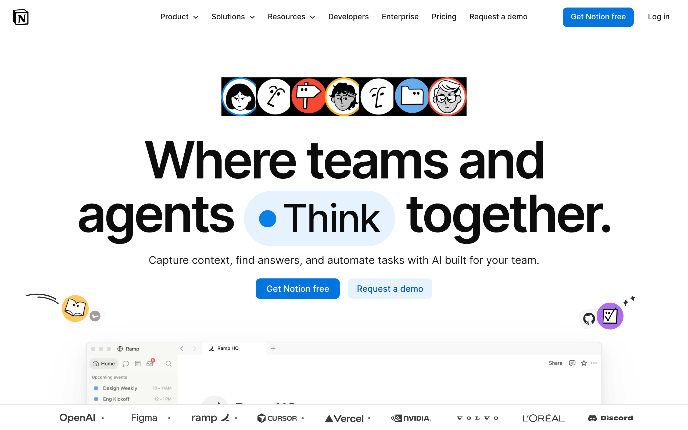
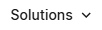
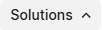
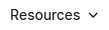
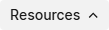

# notion Design System

You are building UI for **notion**. Light-themed, cool palette, sans-serif typography (Noto Sans Arabic), compact density on a 4px grid, expressive motion.

## Visual Reference

**IMPORTANT**: Study ALL screenshots below before writing any UI. Match colors, typography, spacing, layout, and motion exactly as shown.

### Homepage



### Scroll Journey (Cinematic Visual States)

> These screenshots capture the website at different scroll depths. The design changes dramatically as you scroll — each frame shows a different cinematic state. Replicate these exact visual transitions.

#### 0% — Hero / Above the fold


#### 17% — Mid-page at 17% scroll


#### 33% — Mid-page at 33% scroll


#### 50% — Mid-page at 50% scroll


#### 67% — Mid-page at 67% scroll


#### 83% — Mid-page at 83% scroll


#### 100% — Footer / End of page


### Video Backgrounds (First Frames)


> Read `references/DESIGN.md` for full token details. Read `references/ANIMATIONS.md` for motion specs. Read `references/LAYOUT.md` for layout structure. Read `references/COMPONENTS.md` for component patterns.

## Ultra Reference Files

This package includes extended documentation. **Read these files before implementing:**

| File | Contents |
|------|----------|
| `references/DESIGN.md` | Full design system tokens, colors, typography, spacing |
| `references/VISUAL_GUIDE.md` | **START HERE** — Master visual guide with all screenshots embedded |
| `references/ANIMATIONS.md` | CSS keyframes, scroll triggers, motion library stack, video specs |
| `references/LAYOUT.md` | Flex/grid containers, page structure, spacing relationships |
| `references/COMPONENTS.md` | DOM component patterns, HTML structure, class fingerprints |
| `references/INTERACTIONS.md` | Hover/focus states with before/after style diffs |
| `screens/scroll/` | 7 scroll journey screenshots showing cinematic states |

### Animation Stack Detected

- **Web Animations API (36 active)** — animation

## Design Philosophy

- **Layered depth** — use shadow tokens to create a sense of physical layering. Each elevation level has a specific shadow.
- **Gradient accents** — gradients are used thoughtfully for emphasis, not decoration.
- **Type pairing** — Noto Sans Arabic for body/UI text, NotionInter for headings/display. Never introduce a third typeface.
- **compact density** — 4px base grid. Every dimension is a multiple of 4.
- **cool palette** — the color temperature runs cool, matching the sans-serif typography.
- **Restrained accent** — `#0075de` is the only pop of color. Used exclusively for CTAs, links, focus rings, and active states.
- **Expressive motion** — animations are an integral part of the experience. Use spring physics and layout animations.

## Color System

### Core Palette

| Role | Token | Hex | Use |
|------|-------|-----|-----|
| Background | `--background` | `#f9f9f8` | Page/app background |
| Surface | `--surface` | `#e6f3fe` | Cards, panels, modals |
| Text Primary | `--text-primary` | `#000000` | Headings, body text |
| Text Muted | `--text-muted` | `#a39e98` | Captions, placeholders |
| Accent | `--accent` | `#0075de` | CTAs, links, focus rings |
| Border | `--border` | `#31302e` | Dividers, card borders |

### Status Colors

| Status | Hex | Use |
|--------|-----|-----|
| Warning | `#f4bf4f` | Caution states, pending items |
| Danger | `#fdd3cd` | Errors, destructive actions |

### Extended Palette

- **color-gray-600:** `#615d59`
- **color-gray-900:** `#191918` — Deep background layer or shadow color
- **color-blue-400:** `#62aef0`
- **color-blue-500:** `#097fe8`
- **color-campaigns-agents-launch-blue-200:** `#2537b1`
- **color-gray-300:** `#dfdcd9`
- `#2383e2`
- **color-gray-500:** `#78736f`

### CSS Variable Tokens

```css
--border-color-regular: rgb(0 0 0/8%);
--border-radius-0: 0;
--border-radius-200: 0.25rem;
--border-radius-300: 0.3125rem;
--border-radius-400: 0.375rem;
--border-radius-500: 0.5rem;
--border-radius-600: 0.625rem;
--border-radius-700: 0.75rem;
--border-radius-800: 0.875rem;
--border-radius-900: 1rem;
--border-radius-round: 624.9375rem;
--border-width-1: var(--dimension-thickness-1);
--border-style-solid: solid;
--border-style-dashed: dashed;
--font-family-primary-sans: NotionInter;
--font-family-primary-serif: "Lyon Text";
--font-family-primary-serif-japanese: "Lyon Text";
--font-family-primary-serif-chinese-simplified: "Lyon Text";
--font-family-primary-serif-chinese-traditional: "Lyon Text";
--font-family-primary-sans-vietnamese: ui-sans-serif;
```

## Typography

### Font Stack

- **Noto Sans Arabic** — Heading 1, Heading 2, Heading 3
- **NotionInter** — Body, Caption
- **iA Writer Mono** — Code

### Font Sources

```css
@font-face {
  font-family: "NotionInter";
  src: url("fonts/NotionInter-Regular.woff2") format("woff2");
  font-weight: 400;
}
@font-face {
  font-family: "NotionInter";
  src: url("fonts/NotionInter-700.woff2") format("woff2");
  font-weight: 700;
}
@font-face {
  font-family: "Noto Sans Arabic";
  src: url("fonts/NotoSansArabic-Bold.ttf") format("truetype");
  font-weight: 700;
}
@font-face {
  font-family: "Noto Sans Arabic";
  src: url("fonts/NotoSansArabic-Regular.ttf") format("truetype");
  font-weight: 400;
}
@font-face {
  font-family: "Noto Sans Hebrew";
  src: url("fonts/NotoSansHebrew-Bold.ttf") format("truetype");
  font-weight: 700;
}
@font-face {
  font-family: "Noto Sans Hebrew";
  src: url("fonts/NotoSansHebrew-Regular.ttf") format("truetype");
  font-weight: 400;
}
@font-face {
  font-family: "Lyon Text";
  src: url("fonts/LyonText-Regular.woff2") format("woff2");
  font-weight: 400;
}
@font-face {
  font-family: "iA Writer Mono";
  src: url("fonts/iAWriterMono-Regular.woff2") format("woff2");
  font-weight: 400;
}
@font-face {
  font-family: "Permanent Marker";
  src: url("fonts/PermanentMarker-Regular.ttf") format("truetype");
  font-weight: 400;
}
```

### Type Scale

| Role | Family | Size | Weight |
|------|--------|------|--------|
| Heading 1 | Noto Sans Arabic | 80px | 700 |
| Heading 2 | Noto Sans Arabic | 78px | 700 |
| Heading 3 | Noto Sans Arabic | 61px | 700 |
| Body | NotionInter | 14px | 400 |
| Caption | NotionInter | 16px | 400 |
| Code | iA Writer Mono | 14px | 400 |

### Typography Rules

- Body/UI: **Noto Sans Arabic**, Headings: **NotionInter** — these are the only display fonts
- Max 3-4 font sizes per screen
- Headings: weight 600-700, body: weight 400
- Use color and opacity for text hierarchy, not additional font sizes
- Line height: 1.5 for body, 1.2 for headings

## Spacing & Layout

### Base Grid: 4px

Every dimension (margin, padding, gap, width, height) must be a multiple of **4px**.

### Spacing Scale

`2, 4, 6, 8, 10, 12, 14, 16, 18, 20, 22, 24` px

### Spacing as Meaning

| Spacing | Use |
|---------|-----|
| 4-8px | Tight: related items (icon + label, avatar + name) |
| 12-16px | Medium: between groups within a section |
| 24-32px | Wide: between distinct sections |
| 48px+ | Vast: major page section breaks |

### Border Radius

Scale: `4px, 8px, inherit, .25rem, .5em, 1px, 2px, 3vw, 3px, 5px, 6px, 8px 8px 0px 0px, 10px, 12px, 12px 12px 0px 0px, 13px, 14px, 14.4px, 16px, 20px, 24px, 30px, 32px, 36px, 38px, 58px, 100%, 100px, 200px, 1000px`
Default: `13px`

### Container

Max-width: `1079px`, centered with auto margins.

### Breakpoints

| Name | Value |
|------|-------|
| xs | 374px |
| xs | 375px |
| xs | 400px |
| xs | 440px |
| xs | 480px |
| sm | 534px |
| sm | 599px |
| sm | 600px |
| md | 668px |
| md | 700px |
| md | 712px |
| md | 768px |
| lg | 769px |
| lg | 839px |
| lg | 840px |
| lg | 900px |
| lg | 908px |
| lg | 919px |
| lg | 940px |
| lg | 941px |
| lg | 942px |
| lg | 1024px |
| xl | 1032px |
| xl | 1079px |
| xl | 1080px |
| xl | 1120px |
| xl | 1156px |
| xl | 1200px |
| xl | 1280px |
| 2xl | 1300px |
| 2xl | 1440px |
| 2xl | 1600px |
| 2xl | 1800px |
| 2xl | 1900px |

Mobile-first: design for small screens, layer on responsive overrides.

## Component Patterns

### Card

```css
.card {
  background: #e6f3fe;
  border: 1px solid #31302e;
  border-radius: 13px;
  padding: 16px;
  box-shadow: var(--shadow-200);
}
```

```html
<div class="card">
  <h3>Card Title</h3>
  <p>Card content goes here.</p>
</div>
```

### Button

```css
/* Primary */
.btn-primary {
  background: #0075de;
  color: #000000;
  border-radius: 13px;
  padding: 8px 16px;
  font-weight: 500;
  transition: opacity 150ms ease;
}
.btn-primary:hover { opacity: 0.9; }

/* Ghost */
.btn-ghost {
  background: transparent;
  border: 1px solid #31302e;
  color: #000000;
  border-radius: 13px;
  padding: 8px 16px;
}
```

```html
<button class="btn-primary">Get Started</button>
<button class="btn-ghost">Learn More</button>
```

### Input

```css
.input {
  background: #f9f9f8;
  border: 1px solid #31302e;
  border-radius: 13px;
  padding: 8px 12px;
  color: #000000;
  font-size: 14px;
}
.input:focus { border-color: #0075de; outline: none; }
```

```html
<input class="input" type="text" placeholder="Search..." />
```

### Badge / Chip

```css
.badge {
  display: inline-flex;
  align-items: center;
  padding: 4px 8px;
  border-radius: 9999px;
  font-size: 12px;
  font-weight: 500;
  background: #e6f3fe;
  color: #a39e98;
}
```

```html
<span class="badge">New</span>
<span class="badge">Beta</span>
```

### Modal / Dialog

```css
.modal-backdrop { background: rgba(0, 0, 0, 0.6); }
.modal {
  background: #e6f3fe;
  border: 1px solid #31302e;
  border-radius: 1000px;
  padding: 24px;
  max-width: 480px;
  width: 90vw;
  box-shadow: 0 0 20px 5px rgba(255,255,255,.2);
}
```

```html
<div class="modal-backdrop">
  <div class="modal">
    <h2>Dialog Title</h2>
    <p>Dialog content.</p>
    <button class="btn-primary">Confirm</button>
    <button class="btn-ghost">Cancel</button>
  </div>
</div>
```

### Table

```css
.table { width: 100%; border-collapse: collapse; }
.table th {
  text-align: left;
  padding: 8px 12px;
  font-weight: 500;
  font-size: 12px;
  color: #a39e98;
  text-transform: uppercase;
  letter-spacing: 0.05em;
  border-bottom: 1px solid #31302e;
}
.table td {
  padding: 12px;
  border-bottom: 1px solid #31302e;
}
```

```html
<table class="table">
  <thead><tr><th>Name</th><th>Status</th><th>Date</th></tr></thead>
  <tbody>
    <tr><td>Item One</td><td>Active</td><td>Jan 1</td></tr>
    <tr><td>Item Two</td><td>Pending</td><td>Jan 2</td></tr>
  </tbody>
</table>
```

### Navigation

```css
.nav {
  display: flex;
  align-items: center;
  gap: 8px;
  padding: 12px 16px;
  border-bottom: 1px solid #31302e;
}
.nav-link {
  color: #a39e98;
  padding: 8px 12px;
  border-radius: 13px;
  transition: color 150ms;
}
.nav-link:hover { color: #000000; }
.nav-link.active { color: #0075de; }
```

```html
<nav class="nav">
  <a href="/" class="nav-link active">Home</a>
  <a href="/about" class="nav-link">About</a>
  <a href="/pricing" class="nav-link">Pricing</a>
  <button class="btn-primary" style="margin-left: auto">Get Started</button>
</nav>
```

### Extracted Components

These components were found in the codebase:

**Button** (`html`)

**Navigation** (`html`)

## Page Structure

The following page sections were detected:

- **Navigation** — Top navigation bar (49 items)
- **Hero** — Hero section (detected from heading structure)
- **Footer** — Page footer with links and info (50 items)
- **Faq** — FAQ/accordion section

When building pages, follow this section order and structure.

## Animation & Motion

This project uses **expressive motion**. Animations are part of the design language.

### CSS Animations

- `fadeIn`
- `fadeOut`
- `scaleIn`
- `scaleOut`
- `popIn`

### Motion Tokens

- **Duration scale:** `0s`, `0ms`, `.5s`, `1s`, `50ms`, `60ms`, `75ms`, `100ms`, `120ms`, `150ms`, `175ms`, `200ms`, `250ms`, `300ms`, `350ms`, `400ms`, `500ms`, `800ms`, `1000ms`, `5000ms`
- **Easing functions:** `ease`, `ease-out`, `ease-in`, `cubic-bezier(.16,1,.3,1)`, `linear`, `ease-in-out`, `cubic-bezier(.25,1,.33,1)`, `cubic-bezier(.645,.045,.355,1)`, `cubic-bezier(.19,1,.22,1)`, `cubic-bezier(.11,0,.5,0)`, `cubic-bezier(0,0,.2,1)`

### Motion Guidelines

- **Duration:** Use values from the duration scale above. Short (0s) for micro-interactions, long (5000ms) for page transitions
- **Easing:** Use `ease` as the default easing curve
- **Direction:** Elements enter from bottom/right, exit to top/left
- **Reduced motion:** Always respect `prefers-reduced-motion` — disable animations when set

## Depth & Elevation

### Shadow Tokens

- Subtle: `inset 0 0 0 1px rgba(35,131,226,.57),0 0 0 2px rgba(35,131,226,.35)`
- Subtle: `0 1px rgba(0,0,0,0)`
- Subtle: `0 1px var(--color-border-base)`
- Subtle: `0 1px 1px 0 rgba(23,43,77,.2),0 0 1px 0 rgba(23,43,77,.2)`
- Subtle: `inset 0-1px 0 var(--color-border-base)`
- Subtle: `0-1px 0 rgba(55,53,47,.09)`

### Z-Index Scale

`0, 1, 2, 3, 4, 10, 20, 50, 99, 100, 101, 102, 1000, 9999, 10001, 99999, 10000000000000000`

Use these exact values — never invent z-index values.

## Anti-Patterns (Never Do)

- **No blur effects** — no backdrop-blur, no filter: blur()
- **No zebra striping** — tables and lists use borders for separation
- **No invented colors** — every hex value must come from the palette above
- **No arbitrary spacing** — every dimension is a multiple of 4px
- **No extra fonts** — only Noto Sans Arabic and NotionInter and iA Writer Mono are allowed
- **No arbitrary border-radius** — use the scale: 4px, 8px, .25rem, .5em, 1px, 2px, 3px, 5px, 6px, 10px
- **No opacity for disabled states** — use muted colors instead

## Workflow

1. **Read** `references/DESIGN.md` before writing any UI code
2. **Pick colors** from the Color System section — never invent new ones
3. **Set typography** — Noto Sans Arabic, NotionInter, iA Writer Mono only, using the type scale
4. **Build layout** on the 4px grid — check every margin, padding, gap
5. **Match components** to patterns above before creating new ones
6. **Apply elevation** — use shadow tokens
7. **Validate** — every value traces back to a design token. No magic numbers.

## Brand Spec

- **Favicon:** `/front-static/favicon.ico`
- **Site URL:** `https://notion.com/`
- **Brand color:** `#0075de`
- **Brand typeface:** Noto Sans Arabic

## Quick Reference

```
Background:     #f9f9f8
Surface:        #e6f3fe
Text:           #000000 / #a39e98
Accent:         #0075de
Border:         #31302e
Font:           Noto Sans Arabic
Spacing:        4px grid
Radius:         13px
Components:     6 detected
```

## When to Trigger

Activate this skill when:
- Creating new components, pages, or visual elements for notion
- Writing CSS, Tailwind classes, styled-components, or inline styles
- Building page layouts, templates, or responsive designs
- Reviewing UI code for design consistency
- The user mentions "notion" design, style, UI, or theme
- Generating mockups, wireframes, or visual prototypes

---

# Full Reference Files

> Every output file is embedded below. Claude has full design system context from /skills alone.

## Design System Tokens (DESIGN.md)

# notion DESIGN.md

> Auto-generated design system — reverse-engineered via static analysis by skillui.
> Frameworks: None detected
> Colors: 20 · Fonts: 3 · Components: 6
> Icon library: not detected · State: not detected
> Primary theme: light · Dark mode toggle: no · Motion: expressive

## Visual Reference

**Match this design exactly** — study colors, fonts, spacing, and component shapes before writing any UI code.


---

## 1. Visual Theme & Atmosphere

This is a **light-themed** interface with a cool, approachable feel. The light background emphasizes content clarity. Typography pairs **NotionInter** for display/headings with **Noto Sans Arabic** for body text, creating clear visual hierarchy through type contrast. Spacing follows a **4px base grid** (compact density), with scale: 2, 4, 6, 8, 10, 12, 14, 16px. The accent color **#0075de** anchors interactive elements (buttons, links, focus rings). Motion is expressive — spring physics, layout animations, and staggered reveals are part of the visual language.

---

## 2. Color Palette & Roles

| Token | Hex | Role | Use |
|---|---|---|---|
| color-gray-100 | `#f9f9f8` | background | Page background, darkest surface |
| color-blue-200 | `#e6f3fe` | surface | Card and panel backgrounds |
| color-black | `#000000` | text-primary | Headings and body text |
| color-gray-400 | `#a39e98` | text-muted | Captions, placeholders, secondary info |
| color-gray-800 | `#31302e` | border | Dividers, card borders, outlines |
| color-blue-600 | `#0075de` | accent | CTAs, links, focus rings, active states |
| color-red-200 | `#fdd3cd` | danger | Error states, destructive actions |
| warning | `#f4bf4f` | warning | Warning states, caution indicators |
| color-blue-400 | `#62aef0` | info | Informational highlights |
| color-gray-600 | `#615d59` | unknown | Palette color |
| color-gray-900 | `#191918` | unknown | Palette color |
| color-blue-500 | `#097fe8` | unknown | Palette color |
| color-campaigns-agents-launch-blue-200 | `#2537b1` | unknown | Palette color |
| color-gray-300 | `#dfdcd9` | unknown | Palette color |
| unknown | `#2383e2` | unknown | Palette color |
| color-gray-500 | `#78736f` | unknown | Palette color |
| color-yellow-100 | `#fff5e0` | unknown | Palette color |
| unknown | `#172b4d` | unknown | Palette color |
| color-yellow-500 | `#ffb110` | unknown | Palette color |
| color-red-500 | `#f64932` | unknown | Palette color |

### CSS Variable Tokens

```css
--border-color-regular: rgb(0 0 0/8%);
--border-radius-0: 0;
--border-radius-200: 0.25rem;
--border-radius-300: 0.3125rem;
--border-radius-400: 0.375rem;
--border-radius-500: 0.5rem;
--border-radius-600: 0.625rem;
--border-radius-700: 0.75rem;
--border-radius-800: 0.875rem;
--border-radius-900: 1rem;
--border-radius-round: 624.9375rem;
--border-width-1: var(--dimension-thickness-1);
--border-style-solid: solid;
--border-style-dashed: dashed;
--font-family-primary-sans: NotionInter;
--font-family-primary-serif: "Lyon Text";
--font-family-primary-serif-japanese: "Lyon Text";
--font-family-primary-serif-chinese-simplified: "Lyon Text";
--font-family-primary-serif-chinese-traditional: "Lyon Text";
--font-family-primary-sans-vietnamese: ui-sans-serif;
```


---

## 3. Typography Rules

**Font Stack:**
- **Noto Sans Arabic** — Heading 1, Heading 2, Heading 3
- **NotionInter** — Body, Caption
- **iA Writer Mono** — Code

**Font Sources:**

```css
@font-face {
  font-family: "NotionInter";
  src: url("fonts/NotionInter-Regular.woff2") format("woff2");
  font-weight: 400;
}
@font-face {
  font-family: "NotionInter";
  src: url("fonts/NotionInter-700.woff2") format("woff2");
  font-weight: 700;
}
@font-face {
  font-family: "Noto Sans Arabic";
  src: url("fonts/NotoSansArabic-Bold.ttf") format("truetype");
  font-weight: 700;
}
@font-face {
  font-family: "Noto Sans Arabic";
  src: url("fonts/NotoSansArabic-Regular.ttf") format("truetype");
  font-weight: 400;
}
@font-face {
  font-family: "Noto Sans Hebrew";
  src: url("fonts/NotoSansHebrew-Bold.ttf") format("truetype");
  font-weight: 700;
}
@font-face {
  font-family: "Noto Sans Hebrew";
  src: url("fonts/NotoSansHebrew-Regular.ttf") format("truetype");
  font-weight: 400;
}
@font-face {
  font-family: "Lyon Text";
  src: url("fonts/LyonText-Regular.woff2") format("woff2");
  font-weight: 400;
}
@font-face {
  font-family: "iA Writer Mono";
  src: url("fonts/iAWriterMono-Regular.woff2") format("woff2");
  font-weight: 400;
}
@font-face {
  font-family: "Permanent Marker";
  src: url("fonts/PermanentMarker-Regular.ttf") format("truetype");
  font-weight: 400;
}
```

| Role | Font | Size | Weight |
|---|---|---|---|
| Heading 1 | Noto Sans Arabic | 80px | 700 |
| Heading 2 | Noto Sans Arabic | 78px | 700 |
| Heading 3 | Noto Sans Arabic | 61px | 700 |
| Body | NotionInter | 14px | 400 |
| Caption | NotionInter | 16px | 400 |
| Code | iA Writer Mono | 14px | 400 |

**Typographic Rules:**
- Limit to 3 font families max per screen
- Use **Noto Sans Arabic** for body/UI text, **NotionInter** for display/headings
- Maintain consistent hierarchy: no more than 3-4 font sizes per screen
- Headings use bold (600-700), body uses regular (400)
- Line height: 1.5 for body text, 1.2 for headings
- Use color and opacity for secondary hierarchy, not additional font sizes


---

## 4. Component Stylings

### Layout (1)

**Footer** — `html`

### Navigation (1)

**Navigation** — `html`

### Data Input (2)

**Button** — `html`
- Animation: 

**Input** — `html`
- State: :focus, :placeholder

### Media (2)

**Image** — `html`

**Icon** — `html`


---

## 5. Layout Principles

- **Base spacing unit:** 4px
- **Spacing scale:** 2, 4, 6, 8, 10, 12, 14, 16, 18, 20, 22, 24
- **Border radius:** 4px, 8px, inherit, .25rem, .5em, 1px, 2px, 3vw, 3px, 5px, 6px, 8px 8px 0px 0px, 10px, 12px, 12px 12px 0px 0px, 13px, 14px, 14.4px, 16px, 20px, 24px, 30px, 32px, 36px, 38px, 58px, 100%, 100px, 200px, 1000px
- **Max content width:** 1079px

**Spacing as Meaning:**
| Spacing | Use |
|---|---|
| 4-8px | Tight: related items within a group |
| 12-16px | Medium: between groups |
| 24-32px | Wide: between sections |
| 48px+ | Vast: major section breaks |


---

## 6. Depth & Elevation

### Flat — subtle depth hints

- `inset 0 0 0 1px rgba(35,131,226,.57),0 0 0 2px rgba(35,131,226,.35)`
- `0 1px rgba(0,0,0,0)`
- `0 1px var(--color-border-base)`

### Raised — cards, buttons, interactive elements

- `var(--shadow-200)`
- `var(--dropdown-shadow)`
- `var(--shadow-300)`

### Floating — dropdowns, popovers, modals

- `0 0 20px 5px rgba(255,255,255,.2)`
- `0 3px 9px rgba(0,0,0,0),0 .7px 1.4625px rgba(0,0,0,0)`
- `0 3px 9px rgba(0,0,0,.03),0 .7px 1.462px rgba(0,0,0,.01)`

### Overlay — full-screen overlays, top-level dialogs

- `0 4px 18px rgba(0,0,0,.04),0 2.025px 7.84688px rgba(0,0,0,.027),0 .8px 2.925px rgba(0,0,0,.02),0 .175px 1.04062px rgba(0,0,0,.013),0 0 1px rgba(255,255,255,.6)`
- `0 4px 18px rgba(0,0,0,.04),0 2.025px 7.84688px rgba(0,0,0,.027),0 .8px 2.925px rgba(0,0,0,.02),0 .175px 1.04062px rgba(0,0,0,.013)`
- `0 8px 30px rgba(0,0,0,.25)`

### Z-Index Scale

`0, 1, 2, 3, 4, 10, 20, 50, 99, 100, 101, 102, 1000, 9999, 10001, 99999, 10000000000000000`


---

## 7. Animation & Motion

This project uses **expressive motion**. Animations are an integral part of the experience.

### CSS Animations

- `@keyframes fadeIn`
- `@keyframes fadeOut`
- `@keyframes scaleIn`
- `@keyframes scaleOut`
- `@keyframes popIn`
- `@keyframes rotate`
- `@keyframes loadingDots_pulse__d8LYi`
- `@keyframes popover_popoverFadeIn__WkJed`

### Animated Components

- **Button**: 

### Motion Guidelines

- Duration: 150-300ms for micro-interactions, 300-500ms for page transitions
- Easing: `ease-out` for enters, `ease-in` for exits
- Always respect `prefers-reduced-motion`


---

## 8. Do's and Don'ts

### Do's

- Use `#0075de` for interactive elements (buttons, links, focus rings)
- Use `#f9f9f8` as the primary page background
- Pair **Noto Sans Arabic** (body) with **NotionInter** (display) — these are the only allowed fonts
- Follow the **4px** spacing grid for all margins, padding, and gaps
- Use the defined shadow tokens for elevation — see Section 6
- Use border-radius from the scale: 4px, 8px, inherit, .25rem, .5em
- Reuse existing components from Section 4 before creating new ones

### Don'ts

- Don't introduce colors outside this palette — extend the design tokens first
- Don't introduce additional font families beyond Noto Sans Arabic and NotionInter and iA Writer Mono
- Don't use arbitrary spacing values — stick to multiples of 4px
- Don't create custom box-shadow values outside the system tokens
- Don't use arbitrary border-radius values — pick from the defined scale
- Don't duplicate component patterns — check Section 4 first
- Don't use backdrop-blur or blur effects

### Anti-Patterns (detected from codebase)

- No blur or backdrop-blur effects
- No zebra striping on tables/lists


---

## 9. Responsive Behavior

| Name | Value | Source |
|---|---|---|
| xs | 374px | css |
| xs | 375px | css |
| xs | 400px | css |
| xs | 440px | css |
| xs | 480px | css |
| sm | 534px | css |
| sm | 599px | css |
| sm | 600px | css |
| md | 668px | css |
| md | 700px | css |
| md | 712px | css |
| md | 768px | css |
| lg | 769px | css |
| lg | 839px | css |
| lg | 840px | css |
| lg | 900px | css |
| lg | 908px | css |
| lg | 919px | css |
| lg | 940px | css |
| lg | 941px | css |
| lg | 942px | css |
| lg | 1024px | css |
| xl | 1032px | css |
| xl | 1079px | css |
| xl | 1080px | css |
| xl | 1120px | css |
| xl | 1156px | css |
| xl | 1200px | css |
| xl | 1280px | css |
| 2xl | 1300px | css |
| 2xl | 1440px | css |
| 2xl | 1600px | css |
| 2xl | 1800px | css |
| 2xl | 1900px | css |

**Approach:** Use `@media (min-width: ...)` queries matching the breakpoints above.


---

## 10. Agent Prompt Guide

Use these as starting points when building new UI:

### Build a Card

```
Background: #e6f3fe
Border: 1px solid #31302e
Radius: 13px
Padding: 16px
Font: Noto Sans Arabic
Use shadow tokens from Section 6.
```

### Build a Button

```
Primary: bg #0075de, text white
Ghost: bg transparent, border #31302e
Padding: 8px 16px
Radius: 13px
Hover: opacity 0.9 or lighter shade
Focus: ring with #0075de
```

### Build a Page Layout

```
Background: #f9f9f8
Max-width: 1079px, centered
Grid: 4px base
Responsive: mobile-first, breakpoints from Section 9
```

### Build a Stats Card

```
Surface: #e6f3fe
Label: #a39e98 (muted, 12px, uppercase)
Value: #000000 (primary, 24-32px, bold)
Status: use success/warning/danger from Section 2
```

### Build a Form

```
Input bg: #f9f9f8
Input border: 1px solid #31302e
Focus: border-color #0075de
Label: #a39e98 12px
Spacing: 16px between fields
Radius: 13px
```

### General Component

```
1. Read DESIGN.md Sections 2-6 for tokens
2. Colors: only from palette
3. Font: Noto Sans Arabic, type scale from Section 3
4. Spacing: 4px grid
5. Components: match patterns from Section 4
6. Elevation: shadow tokens
```

## Visual Guide — Screenshots (VISUAL_GUIDE.md)

# notion — Visual Guide

> Master visual reference. Study every screenshot carefully before implementing any UI.
> Match colors, layout, typography, spacing, and motion states exactly.

**Motion Stack:** **Web Animations API (36 active)**

## Scroll Journey

The page has cinematic scroll animations. Each screenshot below shows the exact visual state at that scroll depth.
**Replicate these transitions precisely** — the design changes dramatically as you scroll.

### Hero — Above the fold

*Scroll position: 0px of 6484px total*


### 17% scroll depth

*Scroll position: 949px of 6484px total*


### 33% scroll depth

*Scroll position: 1843px of 6484px total*


### 50% scroll depth

*Scroll position: 2792px of 6484px total*


### 67% scroll depth

*Scroll position: 3741px of 6484px total*


### 83% scroll depth

*Scroll position: 4635px of 6484px total*


### Footer — End of page

*Scroll position: 5584px of 6484px total*


## Video Backgrounds

These videos play as background elements. Use first-frame as poster image while video loads.

### Video 1 (background)

*Source: `https://videos.ctfassets.net/spoqsaf9291f/1EL7UZIXfcqngxsNSbL8tR/291f61f56f29dd8...`*


## Full Page Screenshots

### The AI workspace that works for you. | Notion

*URL: `https://notion.com/`*


## Section Screenshots

Clipped sections showing individual components in context.

### Section 9 — `header`

*1252×308px*


## Animations & Motion (ANIMATIONS.md)

# Animation Reference

> Cinematic motion design extracted from live DOM. Follow these specs exactly to recreate the experience.

## Motion Technology Stack

| Library | Type | Notes |
|---------|------|-------|
| **Web Animations API (36 active)** | animation |  |

## Scroll Journey

The page is **6,484px** tall. Each frame below shows what the user sees at that scroll depth.

> **Use these screenshots to understand WHAT animates, WHEN it animates, and HOW it moves.**

### 0% — Top / Hero
Scroll position: 0px


### 17% — Opening Section
Scroll position: 949px


### 33% — First Feature Section
Scroll position: 1,843px


### 50% — Mid-Page
Scroll position: 2,792px


### 67% — Lower Content
Scroll position: 3,741px


### 83% — Near Footer
Scroll position: 4,635px


### 100% — Bottom / Footer
Scroll position: 5,584px


## Video Elements

| # | Role | Autoplay | Loop | Muted | Size | First Frame |
|---|------|----------|------|-------|------|-------------|
| 1 | background | — | ✓ | ✓ | 958×599 | [view](../screens/scroll/video-1-frame.png) |

**Video 1 first frame:**


- **Source:** `https://videos.ctfassets.net/spoqsaf9291f/1EL7UZIXfcqngxsNSbL8tR/291f61f56f29dd8e788deaec8561d882/web-homepage-hero-1920`

## Scroll Animation Patterns

| Pattern | Library | Element Count | Duration | Delay | Easing |
|---------|---------|---------------|----------|-------|--------|
| parallax / sticky scroll | CSS | 4 | — | — | — |

### CSS Implementation

## CSS Keyframes (39 extracted)

### `@keyframes fadeIn`

Duration: `0s` · Easing: `linear` · Delay: `0s` · Iteration: `1` · Fill: `none`

Used by: `.appear-instantly`, `.fade-in-fastest`, `.fade-in-fast`, `.fade-in-slow`

```css
@keyframes fadeIn {
  0% {
    opacity: 0;
  }
  100% {
    opacity: 1;
  }
}
```

> Opacity fade

### `@keyframes fadeOut`

Duration: `0.25s` · Easing: `ease-out` · Delay: `0s` · Iteration: `1` · Fill: `none`

Used by: `.fade-out-fast`, `.fade-out-slow`

```css
@keyframes fadeOut {
  0% {
    opacity: 1;
  }
  100% {
    opacity: 0;
  }
}
```

> Opacity fade

### `@keyframes scaleIn`

Duration: `0.25s` · Easing: `ease-in` · Delay: `0s` · Iteration: `1` · Fill: `none`

Used by: `.scale-in-fast`

```css
@keyframes scaleIn {
  0% {
    transform: scale(0.975);
  }
  100% {
    transform: scale(1);
  }
}
```

> Transform/motion animation

### `@keyframes scaleOut`

Duration: `0.25s` · Easing: `ease-out` · Delay: `0s` · Iteration: `1` · Fill: `none`

Used by: `.scale-out-fast`

```css
@keyframes scaleOut {
  0% {
    transform: scale(1);
  }
  100% {
    transform: scale(0.975);
  }
}
```

> Transform/motion animation

### `@keyframes popIn`

Duration: `0.15s` · Easing: `cubic-bezier(0.175, 0.885, 0.32, 1.275)` · Delay: `0s` · Iteration: `1` · Fill: `none`

Used by: `.pop-in`

```css
@keyframes popIn {
  0% {
    opacity: 0;
    transform: scale(0.75);
  }
  100% {
    opacity: 1;
    transform: scale(1);
  }
}
```

> Fade + motion enter animation

### `@keyframes rotate`

Duration: `1s` · Easing: `linear` · Delay: `0s` · Iteration: `infinite` · Fill: `none`

Used by: `.loading-spinner`

```css
@keyframes rotate {
  0% {
    transform: rotate(0deg) translateZ(0px);
  }
  100% {
    transform: rotate(1turn) translateZ(0px);
  }
}
```

> Transform/motion animation

### `@keyframes globalNavigation_slideDown__fiX_y`

Duration: `0.3s` · Easing: `ease-out` · Delay: `0s` · Iteration: `1` · Fill: `forwards`

Used by: `.globalNavigation_mobileSubmenu__ndil4`

```css
@keyframes globalNavigation_slideDown__fiX_y {
  0% {
    opacity: 0;
    transform: translateY(-10px);
  }
  100% {
    opacity: 1;
    transform: translateY(0px);
  }
}
```

> Fade + motion enter animation

### `@keyframes modal_backgroundFadeOut__jw_M8`

Duration: `0.25s` · Easing: `ease-out` · Delay: `0s` · Iteration: `1` · Fill: `none`

Used by: `.modal_modalScrimFadeOut__IlFXO`

```css
@keyframes modal_backgroundFadeOut__jw_M8 {
  0% {
    opacity: 1;
  }
  100% {
    opacity: 0;
  }
}
```

> Opacity fade

### `@keyframes loadingDots_pulse__d8LYi`

```css
@keyframes loadingDots_pulse__d8LYi {
  0% {
    opacity: 0.2;
  }
  100% {
    opacity: 0.75;
  }
}
```

> Opacity fade

### `@keyframes globalNavigation_navShadowScrolled__pZKcg`

```css
@keyframes globalNavigation_navShadowScrolled__pZKcg {
  0% {
    box-shadow: rgba(0, 0, 0, 0) 0px 1px;
  }
  100% {
    box-shadow: 0 1px var(--color-border-base);
  }
}
```

> Shadow pulse/glow effect

### `@keyframes globalNavigation_fadeIn__BTvkx`

```css
@keyframes globalNavigation_fadeIn__BTvkx {
  0% {
    opacity: 0;
  }
  100% {
    opacity: 1;
  }
}
```

> Opacity fade

### `@keyframes globalNavigation_fadeOut__UET7A`

```css
@keyframes globalNavigation_fadeOut__UET7A {
  0% {
    opacity: 1;
  }
  100% {
    opacity: 0;
  }
}
```

> Opacity fade

### `@keyframes globalNavigation_navTokensHeroExit__nkR7m`

```css
@keyframes globalNavigation_navTokensHeroExit__nkR7m {
  0% {
    --color-text-normal: var(--color-gray-200);
    --color-background-base-hover: var(--color-alpha-white-100);
    --color-border-base: var(--color-alpha-white-200);
    --color-button-primary-text: var(--color-white);
    --color-button-primary-background: var(--color-campaigns-agents-launch-blue-400);
    --color-button-primary-background-hover: var(--color-campaigns-agents-launch-blue-300);
    --color-button-primary-background-focus: var(--color-campaigns-agents-launch-blue-300);
    --color-button-primary-background-active: var(--color-campaigns-agents-launch-blue-300);
    --color-button-ghost-text: var(--color-white);
    --color-button-ghost-background-hover: var(--color-alpha-white-200);
    --color-button-ghost-background-focus: var(--color-alpha-white-200);
    --color-button-ghost-background-active: var(--color-alpha-white-200);
    --color-text-muted: var(--color-white);
  }
  100% {
    --color-text-normal: inherit;
    --color-background-base-hover: inherit;
    --color-border-base: inherit;
    --color-button-primary-text: inherit;
    --color-button-primary-background: inherit;
    --color-button-primary-background-hover: inherit;
    --color-button-primary-background-focus: inherit;
    --color-button-primary-background-active: inherit;
    --color-button-ghost-text: inherit;
    --color-button-ghost-background-hover: inherit;
    --color-button-ghost-background-focus: inherit;
    --color-button-ghost-background-active: inherit;
    --color-text-muted: inherit;
  }
}
```

> Background color/gradient shift · Border animation

### `@keyframes globalNavigation_navBgVarHeroExit__Kk6M2`

```css
@keyframes globalNavigation_navBgVarHeroExit__Kk6M2 {
  0% {
    --campaign-nav-bg: var(--color-campaigns-agents-launch-blue-900);
  }
  100% {
    --campaign-nav-bg: var(--color-background-base);
  }
}
```

### `@keyframes globalNavigation_logoFillHeroExit__liWYo`

```css
@keyframes globalNavigation_logoFillHeroExit__liWYo {
  0% {
    --notion-logo-fill: var(--color-campaigns-agents-launch-blue-900);
  }
  100% {
    --notion-logo-fill: var(--color-black);
  }
}
```

### `@keyframes globalNavigation_navBgScrolled__qcb4e`

```css
@keyframes globalNavigation_navBgScrolled__qcb4e {
  0% {
    --campaign-nav-bg: transparent;
  }
  100% {
    --campaign-nav-bg: var(--color-campaigns-agents-launch-blue-900);
  }
}
```

### `@keyframes globalNavigation_thinkTogetherNavTokensHeroExit__P9vdt`

```css
@keyframes globalNavigation_thinkTogetherNavTokensHeroExit__P9vdt {
  0% {
    --color-text-normal: var(--color-gray-200);
    --color-text-muted: var(--color-alpha-white-700);
    --color-background-base-hover: var(--color-alpha-white-100);
    --color-border-base: var(--color-alpha-white-200);
    --color-button-primary-text: var(--color-white);
    --color-button-primary-background: var(--color-blue-500);
    --color-button-primary-background-hover: var(--color-blue-400);
    --color-button-primary-background-focus: var(--color-blue-400);
    --color-button-primary-background-active: var(--color-blue-400);
    --color-button-ghost-text: var(--color-white);
    --color-button-ghost-background: var(--color-transparent);
    --color-button-ghost-background-hover: var(--color-alpha-white-100);
    --color-button-ghost-background-focus: var(--color-alpha-white-100);
    --color-button-ghost-background-active: var(--color-alpha-white-200);
  }
  100% {
    --color-text-normal: inherit;
    --color-text-muted: inherit;
    --color-background-base-hover: inherit;
    --color-border-base: inherit;
    --color-button-primary-text: inherit;
    --color-button-primary-background: inherit;
    --color-button-primary-background-hover: inherit;
    --color-button-primary-background-focus: inherit;
    --color-button-primary-background-active: inherit;
    --color-button-ghost-text: inherit;
    --color-button-ghost-background: inherit;
    --color-button-ghost-background-hover: inherit;
    --color-button-ghost-background-focus: inherit;
    --color-button-ghost-background-active: inherit;
  }
}
```

> Background color/gradient shift · Border animation

### `@keyframes globalNavigation_thinkTogetherNavBgHeroExit__vSKro`

```css
@keyframes globalNavigation_thinkTogetherNavBgHeroExit__vSKro {
  0% {
    --hero-nav-bg: var(--color-gray-900);
  }
  100% {
    --hero-nav-bg: var(--color-white);
  }
}
```

### `@keyframes globalNavigation_thinkTogetherLogoFillHeroExit__33UgN`

```css
@keyframes globalNavigation_thinkTogetherLogoFillHeroExit__33UgN {
  0% {
    --notion-logo-fill: var(--color-gray-900);
  }
  100% {
    --notion-logo-fill: var(--color-black);
  }
}
```

### `@keyframes globalNavigation_thinkTogetherNavBgScrolled__HeD6_`

```css
@keyframes globalNavigation_thinkTogetherNavBgScrolled__HeD6_ {
  0% {
    --hero-nav-bg: transparent;
  }
  100% {
    --hero-nav-bg: var(--color-gray-900);
  }
}
```

### `@keyframes globalNavigation_devPlatformNavTokensHeroExit__wdo2n`

```css
@keyframes globalNavigation_devPlatformNavTokensHeroExit__wdo2n {
  0% {
    --color-interaction-focus-ring: var(--color-campaigns-dev-platform-dos-alpha-white);
    --color-text-normal: var(--color-white);
    --color-text-muted: var(--color-alpha-white-700);
    --color-border-base: var(--color-alpha-white-200);
    --color-background-base-hover: var(--color-alpha-white-100);
    --color-button-primary-text: var(--color-campaigns-dev-platform-dos-blue);
    --color-button-primary-background: var(--color-campaigns-dev-platform-dos-white);
    --color-button-primary-background-hover: var(--color-campaigns-dev-platform-dos-alpha-white);
    --color-button-primary-background-focus: var(--color-campaigns-dev-platform-dos-alpha-white);
    --color-button-primary-background-active: var(--color-campaigns-dev-platform-dos-alpha-white);
    --color-button-ghost-text: var(--color-white);
    --color-button-ghost-background-hover: var(--color-alpha-white-200);
    --color-button-ghost-background-focus: var(--color-alpha-white-200);
    --color-button-ghost-background-active: var(--color-alpha-white-200);
    --color-nav-text: var(--color-white);
    --color-nav-bracket: var(--color-campaigns-dev-platform-dos-alpha-gray);
    --color-nav-letter-hint: var(--color-campaigns-dev-platform-dos-alpha-white);
  }
  100% {
    --color-interaction-focus-ring: var(--color-campaigns-dev-platform-dos-alpha-blue);
    --color-text-normal: var(--color-campaigns-dev-platform-dos-alpha-blue);
    --color-text-muted: var(--color-campaigns-dev-platform-dos-alpha-blue);
    --color-border-base: inherit;
    --color-background-base-hover: inherit;
    --color-button-primary-text: var(--color-white);
    --color-button-primary-background: var(--color-campaigns-dev-platform-dos-blue);
    --color-button-primary-background-hover: var(--color-campaigns-dev-platform-dos-black);
    --color-button-primary-background-focus: var(--color-campaigns-dev-platform-dos-black);
    --color-button-primary-background-active: var(--color-campaigns-dev-platform-dos-black);
    --color-button-ghost-text: inherit;
    --color-button-ghost-background-hover: inherit;
    --color-button-ghost-background-focus: inherit;
    --color-button-ghost-background-active: inherit;
    --color-nav-text: var(--color-campaigns-dev-platform-dos-blue);
    --color-nav-bracket: var(--color-campaigns-dev-platform-dos-alpha-blue);
    --color-nav-letter-hint: var(--color-campaigns-dev-platform-dos-blue);
  }
}
```

> Background color/gradient shift · Border animation

### `@keyframes globalNavigation_devPlatformNavBgHeroExit__Pir6F`

```css
@keyframes globalNavigation_devPlatformNavBgHeroExit__Pir6F {
  0% {
    --dev-platform-nav-bg: transparent;
  }
  100% {
    --dev-platform-nav-bg: var(--color-background-base);
  }
}
```

### `@keyframes globalNavigation_devPlatformNavBgScrolled__1YsK_`

```css
@keyframes globalNavigation_devPlatformNavBgScrolled__1YsK_ {
  0% {
    --dev-platform-nav-bg: transparent;
  }
  100% {
    --dev-platform-nav-bg: var(--color-campaigns-dev-platform-dos-blue);
  }
}
```

### `@keyframes homepageLogoWall_revealStickyBar__Glf7s`

```css
@keyframes homepageLogoWall_revealStickyBar__Glf7s {
  0% {
    opacity: 1;
  }
  100% {
    opacity: 0;
  }
}
```

> Opacity fade

### `@keyframes Agent_agentEnter__D6zdB`

```css
@keyframes Agent_agentEnter__D6zdB {
  0% {
    translate: var(--translate-agent-start);
    transform: rotate(var(--rotate-agent-start));
  }
  100% {
    translate: 0px;
    transform: rotate(0deg);
  }
}
```

> Transform/motion animation

### `@keyframes Agent_agentScroll__R_Ymn`

```css
@keyframes Agent_agentScroll__R_Ymn {
  0% {
    translate: 0px;
    transform: rotate(0deg);
  }
  100% {
    translate: var(--translate-agent-end);
    transform: rotate(var(--rotate-agent-end));
  }
}
```

> Transform/motion animation

### `@keyframes Agent_agentTaskEnter__ZpDY1`

```css
@keyframes Agent_agentTaskEnter__ZpDY1 {
  0% {
    translate: var(--translate-task-start);
    transform: rotate(var(--rotate-task-start));
  }
  100% {
    translate: var(--translate-task);
    transform: rotate(var(--rotate-task));
  }
}
```

> Transform/motion animation

### `@keyframes Agent_agentTaskScroll__bimxl`

```css
@keyframes Agent_agentTaskScroll__bimxl {
  0% {
    translate: 0px;
    transform: rotate(0deg);
  }
  100% {
    translate: var(--translate-task-end);
    transform: rotate(var(--rotate-task-end));
  }
}
```

> Transform/motion animation

### `@keyframes Agent_agentMarkEnter__54wKq`

```css
@keyframes Agent_agentMarkEnter__54wKq {
  0% {
    translate: var(--translate-mark-start);
    transform: rotate(var(--rotate-mark-start));
  }
  100% {
    translate: var(--translate-mark);
    transform: rotate(var(--rotate-mark));
  }
}
```

> Transform/motion animation

### `@keyframes Agent_agentMarkScroll__8jDZS`

```css
@keyframes Agent_agentMarkScroll__8jDZS {
  0% {
    translate: 0px;
    transform: rotate(0deg);
  }
  100% {
    translate: var(--translate-mark-end);
    transform: rotate(var(--rotate-mark-end));
  }
}
```

> Transform/motion animation

### `@keyframes Agent_notifCountScroll__2TpV_`

```css
@keyframes Agent_notifCountScroll__2TpV_ {
  0% {
    --notif-step: 0;
  }
  100% {
    --notif-step: 7;
  }
}
```

### `@keyframes Agent_notifCountScrollFast__Ty0lv`

```css
@keyframes Agent_notifCountScrollFast__Ty0lv {
  0% {
    --notif-step: 0;
  }
  100% {
    --notif-step: 14;
  }
}
```

### `@keyframes Illustrations_rotate__NJalO`

```css
@keyframes Illustrations_rotate__NJalO {
  0% {
    transform: rotate(0deg);
  }
  100% {
    transform: rotate(var(--rotate-end));
  }
}
```

> Transform/motion animation

### `@keyframes Illustrations_rotateEnter__XYlPM`

```css
@keyframes Illustrations_rotateEnter__XYlPM {
  0% {
    transform: rotate(var(--rotate-start));
  }
  100% {
    transform: rotate(0deg);
  }
}
```

> Transform/motion animation

### `@keyframes HomepageHeroAgents_flicker-on__xJ_1J`

```css
@keyframes HomepageHeroAgents_flicker-on__xJ_1J {
  0% {
    opacity: 0;
  }
  100% {
    opacity: 1;
  }
}
```

> Opacity fade

### `@keyframes HomepageHeroAgents_flicker__k9DWp`

```css
@keyframes HomepageHeroAgents_flicker__k9DWp {
  0%, 100% {
    opacity: 1;
  }
  12%, 13.2% {
    opacity: 1;
  }
  12.2% {
    opacity: 0.7;
  }
  12.5% {
    opacity: 0.92;
  }
  12.7% {
    opacity: 0.65;
  }
  13% {
    opacity: 0.9;
  }
  32%, 32.8% {
    opacity: 1;
  }
  32.3% {
    opacity: 0.75;
  }
  32.5% {
    opacity: 0.88;
  }
  55%, 56.5% {
    opacity: 1;
  }
  55.2% {
    opacity: 0.8;
  }
  55.5% {
    opacity: 0.6;
  }
  55.8% {
    opacity: 0.85;
  }
  56% {
    opacity: 0.7;
  }
  56.3% {
    opacity: 0.92;
  }
  77%, 77.6% {
    opacity: 1;
  }
  77.2% {
    opacity: 0.68;
  }
  77.4% {
    opacity: 0.9;
  }
  92%, 92.5% {
    opacity: 1;
  }
  92.2% {
    opacity: 0.78;
  }
}
```

> Opacity fade

### `@keyframes HomepageHeroAgents_fade-in__HBybG`

```css
@keyframes HomepageHeroAgents_fade-in__HBybG {
  0% {
    opacity: var(--opacity-start);
  }
  100% {
    opacity: var(--opacity-end);
  }
}
```

> Opacity fade

### `@keyframes homepage_bodyBgHeroExit__Ur0t_`

```css
@keyframes homepage_bodyBgHeroExit__Ur0t_ {
  0% {
    background-color: var(--color-gray-900);
  }
  100% {
    background-color: rgba(0, 0, 0, 0);
  }
}
```

> Background color/gradient shift · Text color shift

### `@keyframes Marquee_marqueeFrames__WsEH6`

```css
@keyframes Marquee_marqueeFrames__WsEH6 {
  0% {
    transform: translateX(0px);
  }
  100% {
    transform: translateX(calc(-50% - var(--marquee-item-gap) / 2));
  }
}
```

> Transform/motion animation

## Motion Tokens (CSS Variables)

### Duration Tokens

```css
--motion-duration-100: 100ms;
--motion-duration-150: 150ms;
--motion-duration-200: 200ms;
--motion-duration-250: 250ms;
--motion-duration-300: 300ms;
--motion-global-fade-out-duration: 200ms;
--motion-global-transform-duration: 300ms;
--motion-global-fade-in-duration: 150ms;
```

### Easing Tokens

```css
--motion-timing-function-ease-in-out-quint: cubic-bezier(0.86,0,0.07,1);
--motion-timing-function-ease-in-out-quart: cubic-bezier(0.76,0,0.24,1);
--motion-timing-function-ease-in-out-quad: cubic-bezier(0.45,0,0.55,1);
--motion-timing-function-ease-in-out-cubic: cubic-bezier(0.645,0.045,0.355,1);
--motion-timing-function-ease-in-out-linear: cubic-bezier(0.5,0,0.5,1);
--motion-timing-function-ease-in: cubic-bezier(0.42,0,1,1);
--motion-timing-function-ease-out: cubic-bezier(0,0,0.58,1);
--motion-timing-function-linear: cubic-bezier(0,0,1,1);
--motion-global-transform-timing-function: cubic-bezier(0.86,0,0.07,1);
--motion-global-fade-out-timing-function: cubic-bezier(0.42,0,1,1);
--motion-global-fade-in-timing-function: cubic-bezier(0,0,0.58,1);
```

## Global Transition Declarations

These `transition` values were extracted from CSS rules across the site:

```css
transition: background 0.15s;
transition: transform 0.3s;
transition: box-shadow var(--motion-global-fade-out-duration) var(--motion-global-fade-out-timing-function);
transition: background-color 0.15s;
transition: opacity 0.25s ease-out, transform 0.25s ease-out, visibility 0.25s ease-out;
transition: opacity 0.15s ease-in 50ms, transform 0.15s ease-in, visibility 0.15s ease-in;
transition: transform 0.35s cubic-bezier(0.16, 1, 0.3, 1);
transition: transform 175ms ease-in 0.15s;
transition: opacity 0.4s ease-out;
transition: opacity 0.15s ease-in;
transition: background 75ms linear;
transition: opacity 0.15s ease-in-out;
```

## How to Recreate This Motion Design

### Step 1 — Install Dependencies

```bash
```

### Step 2 — Scroll-Reveal Pattern

Elements that animate into view follow this pattern:

```css
/* Initial hidden state */
.reveal {
  opacity: 0;
  transform: translateY(40px);
  transition: opacity 100ms cubic-bezier(0.86,0,0.07,1),
              transform 100ms cubic-bezier(0.86,0,0.07,1);
}
.reveal.visible {
  opacity: 1;
  transform: translateY(0);
}
```

### Step 3 — Key Motion Principles

- **Video backgrounds** — use `<video autoplay loop muted playsinline>` for background videos. Always include a poster image fallback
- **Duration scale:** `100ms` · `150ms` · `200ms` · `250ms` · `300ms` · `0.15s` · `0.3s` · `0.25s` — use these values, never invent new durations
- **Always add** `@media (prefers-reduced-motion: reduce) { * { animation-duration: 0.01ms !important; transition-duration: 0.01ms !important; } }`

### Step 4 — Scroll Journey Reference

Match what happens at each scroll position:

- **0%** (`0px`) → `screens/scroll/scroll-000.png`
- **17%** (`949px`) → `screens/scroll/scroll-017.png`
- **33%** (`1843px`) → `screens/scroll/scroll-033.png`
- **50%** (`2792px`) → `screens/scroll/scroll-050.png`
- **67%** (`3741px`) → `screens/scroll/scroll-067.png`
- **83%** (`4635px`) → `screens/scroll/scroll-083.png`
- **100%** (`5584px`) → `screens/scroll/scroll-100.png`

## Layout & Grid (LAYOUT.md)

# Layout Reference

> Auto-extracted from live DOM. Use this to understand how the site is structured spatially.

## Spacing System

**Base grid:** 4px

**Scale:** `2, 4, 6, 8, 10, 12, 14, 16, 18, 20, 22, 24, 26, 28, 30` px

| Spacing | Semantic Use |
|---------|-------------|
| 4px | Tight — within a component |
| 8px | Medium — between sibling items |
| 16px | Wide — between sections |
| 32px | Vast — major section breaks |

## Flex Layouts

| Element | Direction | Justify | Align | Gap | Children |
|---------|-----------|---------|-------|-----|----------|
| `nav.footer_footerInner__MQQSo` | row | — | — | 24px | 2 |
| `div.flex.flex-col` | column | center | center | 12px | 2 |
| `div.flex.flex-col` | row | center | center | 12px | 2 |
| `section#_R_4n59bm_.bentos_bentoSection__5jULI` | column | — | — | 32px | 2 |
| `section#_R_4n59bmH1_.bentos_bentoSection__5jULI` | column | — | — | 32px | 2 |
| `div.flex.flex-row` | row | center | center | 0px | 7 |
| `ul.flex.flex-col` | column | start | stretch | 0px | 7 |
| `ul.flex.flex-col` | column | start | stretch | 0px | 5 |
| `ul.flex.flex-col` | column | start | stretch | 0px | 8 |
| `ul.flex.flex-col` | column | start | stretch | 0px | 5 |
| `section.homepageBentoCarousel_root__XEVDN` | column | — | — | 32px | 2 |
| `div.flex.flex-col` | column | start | stretch | 16px | 4 |
| `div.flex.flex-col` | column | start | stretch | 8px | 2 |
| `div.flex.flex-col` | row | start | stretch | 8px | 5 |

## Grid Layouts

| Element | Template Columns | Gap | Children |
|---------|-----------------|-----|----------|
| `nav.globalNavigation_globalNavigation__7c1YP` | `1440px` | — | 1 |
| `div.heroGrid_heroGrid__v65U8` | `[full-bleed-start] 30px [full-start] 64px [content` | — | 5 |
| `div.globalNavigation_container__x43sE` | `328.375px 703.25px 328.375px` | 16px | 3 |
| `div.socialProofV2_cards__SRQPo` | `393.594px 393.609px 393.594px` | 24px | 3 |

## Structural Containers

### `<main>` (`main.layout_main__LAl4b.layout_withoutPadding__qQ631`)

```
display:          block
children:         4
```

### `<footer>` (`footer.surface.surfaceBase`)

```
display:          block
children:         1
```

### `<nav>` (`nav.footer_footerInner__MQQSo`)

```
display:          flex
flex-direction:   row
justify-content:  —
align-items:      —
gap:              24px
padding:          80px 125px
max-width:        1502px
children:         2
```

### `<section>` (`section#_R_1bmH1_`)

```
display:          block
children:         2
```

### `<nav>` (`nav.globalNavigation_globalNavigation__7c1YP`)

```
display:          grid
grid-template-columns: 1440px
children:         1
```

### `<section>` 

```
display:          block
children:         2
```

### `<header>` (`header.homepageHeroTeamsAndAgents_contentHeader__8R13o`)

```
display:          block
children:         3
```

### `<section>` (`section#_R_4n59bm_.bentos_bentoSection__5jULI`)

```
display:          flex
flex-direction:   column
justify-content:  —
align-items:      —
gap:              32px
children:         2
```

### `<section>` (`section#_R_4n59bmH1_.bentos_bentoSection__5jULI`)

```
display:          flex
flex-direction:   column
justify-content:  —
align-items:      —
gap:              32px
children:         2
```

### `<section>` (`section.homepageBentoCarousel_root__XEVDN`)

```
display:          flex
flex-direction:   column
justify-content:  —
align-items:      —
gap:              32px
children:         2
```

### `<section>` (`section#_R_in59bm_`)

```
display:          block
children:         1
```

### `<section>` (`section.bentoCarousel_bentoCarousel__QXKNe`)

```
display:          block
children:         1
```

## Layout Rules

- **Container max-width:** `1502px` — always center with `margin: auto`
- Primary layout system: **Flexbox**
- Secondary layout system: **CSS Grid** (used for card grids and multi-column layouts)
- Every spacing value must be a multiple of **4px**
- Never use arbitrary margin/padding values outside the spacing scale

## Component Patterns (COMPONENTS.md)

# Component Reference

> Repeated DOM patterns detected by structural analysis. Each component appeared 3+ times.

## Detected Components

| Component | Category | Instances | Key Classes |
|-----------|----------|-----------|-------------|
| **MenuList Label  SGqyS** | card | 38× | `.menuList_label__SGqyS`, `.semanticTypography_semanticTypography__mWJkv`, `.semanticTypography_variantInteractionMenuListItemLabelEmphasis__pDF73` |
| **Next Image** | unknown | 32× | `.next-image` |
| **Base Theme  K5IIh** | card | 22× | `.base_theme__K5IIh`, `.menuList_menuListItem___Rmlj` |
| **Inline Full** | card | 15× | `.inline-full`, `.menuList_menuListItemAnchor__dEwSU`, `.menuList_variantPrimary__XdPVz` |
| **GlobalNavigation DesktopDropDownNavigationHeading  TA Tr** | list-item | 10× | `.globalNavigation_desktopDropDownNavigationHeading__tA_tr`, `.menuList_heading__HgTG9`, `.semanticTypography_semanticTypography__mWJkv` |
| **Typography Typography  Exx2D** | unknown | 8× | `.typography_typography__Exx2D` |
| **Inline Full** | card | 7× | `.inline-full`, `.menuList_menuListItemAnchor__dEwSU`, `.menuList_sizeLarge__gpJH5` |
| **Flex** | card | 6× | `.flex`, `.flex-col`, `.flex-nowrap` |
| **Agent AgentGraphicEnterWrapper  Se BZ** | unknown | 6× | `.Agent_agentGraphicEnterWrapper__Se_bZ` |
| **GlobalNavigation Link  OfzIw** | unknown | 5× | `.globalNavigation_link__ofzIw` |
| **Agent AgentTaskEnterWrapper  QRPdH** | unknown | 5× | `.Agent_agentTaskEnterWrapper__qRPdH` |
| **Agent AgentTask  J7mO1** | unknown | 5× | `.Agent_agentTask__J7mO1` |
| **GlobalNavigation DropdownContainer  8i441** | unknown | 3× | `.globalNavigation_dropdownContainer__8i441` |
| **GlobalNavigation DropdownTrigger  Vd0Te** | button | 3× | `.globalNavigation_dropdownTrigger__Vd0Te`, `.globalNavigation_link__ofzIw` |
| **GlobalNavigation Dropdown  Vn77x** | unknown | 3× | `.globalNavigation_dropdown__vn77x` |
| **Card CardAnchor  XsVOe** | card | 3× | `.card_cardAnchor__xsVOe` |
| **Card CardMedia  DG2VH** | card | 3× | `.card_cardMedia__dG2VH`, `.productFeaturesDropdown_featureMedia__pRydw` |
| **ProductFeaturesDropdown FeatureContent  XUdjG** | card | 3× | `.productFeaturesDropdown_featureContent__XUdjG` |
| **Card CardTitle  Zo4Kt** | card | 3× | `.card_cardTitle__zo4Kt`, `.productFeaturesDropdown_featureTitle__Xr2pN`, `.semanticTypography_semanticTypography__mWJkv` |
| **Card CardBody  NmxT** | card | 3× | `.card_cardBody__NmxT_`, `.productFeaturesDropdown_featureDescription__Pbvbz`, `.semanticTypography_semanticTypography__mWJkv` |

## Cards

### MenuList Label  SGqyS

**Instances found:** 38

**CSS classes:** `.menuList_label__SGqyS` `.semanticTypography_semanticTypography__mWJkv` `.semanticTypography_variantInteractionMenuListItemLabelEmphasis__pDF73`

**HTML structure:**

```html
<span class="semanticTypography_semanticTypography__mWJkv semanticTypography_variantInteractionMenuListItemLabelEmphasis__pDF73 menuList_label__SGqyS">Eng &amp; Product</span>
```

**Base styles (from design tokens):**

```css
.menuList_label__SGqyS {
  background: #e6f3fe;
  border: 1px solid #31302e;
  border-radius: 13px;
  padding: 8px;
}```

### Base Theme  K5IIh

**Instances found:** 22

**CSS classes:** `.base_theme__K5IIh` `.menuList_menuListItem___Rmlj`

**HTML structure:**

```html
<li class="menuList_menuListItem___Rmlj base_theme__K5IIh"><a class="inline-full menuList_menuListItemAnchor__dEwSU menuList_sizeLarge__gpJH5 menuList_variantPrimary__XdPVz" href="/product/notion-for-product-development"><span class="semanticTypography_semanticTypography__mWJkv semanticTypography_variantInteractionMenuListItemLabelEmphasis__pDF73 menuList_label__SGqyS">Eng &amp; Product</span></a></li>
```

**Base styles (from design tokens):**

```css
.base_theme__K5IIh {
  background: #e6f3fe;
  border: 1px solid #31302e;
  border-radius: 13px;
  padding: 8px;
}```

### Inline Full

**Instances found:** 15

**CSS classes:** `.inline-full` `.menuList_menuListItemAnchor__dEwSU` `.menuList_variantPrimary__XdPVz`

**HTML structure:**

```html
<a class="inline-full menuList_menuListItemAnchor__dEwSU menuList_variantPrimary__XdPVz" href="/startups"><span class="semanticTypography_semanticTypography__mWJkv semanticTypography_variantInteractionMenuListItemLabel___7StL menuList_label__SGqyS">Startups</span></a>
```

**Base styles (from design tokens):**

```css
.inline-full {
  background: #e6f3fe;
  border: 1px solid #31302e;
  border-radius: 13px;
  padding: 8px;
}```

### Inline Full

**Instances found:** 7

**CSS classes:** `.inline-full` `.menuList_menuListItemAnchor__dEwSU` `.menuList_sizeLarge__gpJH5` `.menuList_variantPrimary__XdPVz`

**HTML structure:**

```html
<a class="inline-full menuList_menuListItemAnchor__dEwSU menuList_sizeLarge__gpJH5 menuList_variantPrimary__XdPVz" href="/product/notion-for-product-development"><span class="semanticTypography_semanticTypography__mWJkv semanticTypography_variantInteractionMenuListItemLabelEmphasis__pDF73 menuList_label__SGqyS">Eng &amp; Product</span></a>
```

**Base styles (from design tokens):**

```css
.inline-full {
  background: #e6f3fe;
  border: 1px solid #31302e;
  border-radius: 13px;
  padding: 8px;
}```

### Flex

**Instances found:** 6

**CSS classes:** `.flex` `.flex-col` `.flex-nowrap` `.gap-0` `.inline-full` `.items-stretch`

**HTML structure:**

```html
<ul aria-labelledby="_R_bl2pkt9bm_" class="flex flex-col items-stretch justify-start flex-nowrap inline-full gap-0 ps-0 mt-0 mb-0 menuList_menuList__Tn7rd"><li role="none" id="_R_bl2pkt9bm_" class="semanticTypography_semanticTypography__mWJkv semanticTypography_variantNavigationHeading__uo7yO menuList_heading__HgTG9 globalNavigation_desktopDropDownNavigationHeading__tA_tr">Teams</li><li class="menuList_menuListItem___Rmlj base_theme__K5IIh"><a class="inline-full menuList_menuListItemAnchor__dEwSU menuList_sizeLarge__gpJH5 menuList_variantPrimary__XdPVz" href="/product/notion-for-product-develo
```

**Base styles (from design tokens):**

```css
.flex {
  background: #e6f3fe;
  border: 1px solid #31302e;
  border-radius: 13px;
  padding: 8px;
}```

### Card CardAnchor  XsVOe

**Instances found:** 3

**CSS classes:** `.card_cardAnchor__xsVOe`

**HTML structure:**

```html
<a class="card_cardAnchor__xsVOe" aria-label="Capture" href="/product/features#capture">&nbsp;</a>
```

**Base styles (from design tokens):**

```css
.card_cardAnchor__xsVOe {
  background: #e6f3fe;
  border: 1px solid #31302e;
  border-radius: 13px;
  padding: 8px;
}```

### Card CardMedia  DG2VH

**Instances found:** 3

**CSS classes:** `.card_cardMedia__dG2VH` `.productFeaturesDropdown_featureMedia__pRydw`

**HTML structure:**

```html
<div class="card_cardMedia__dG2VH productFeaturesDropdown_featureMedia__pRydw" style="--aspect-ratio:1.338235294117647"></div>
```

**Base styles (from design tokens):**

```css
.card_cardMedia__dG2VH {
  background: #e6f3fe;
  border: 1px solid #31302e;
  border-radius: 13px;
  padding: 8px;
}```

### ProductFeaturesDropdown FeatureContent  XUdjG

**Instances found:** 3

**CSS classes:** `.productFeaturesDropdown_featureContent__XUdjG`

**HTML structure:**

```html
<div class="productFeaturesDropdown_featureContent__XUdjG"><h3 class="semanticTypography_semanticTypography__mWJkv semanticTypography_variantCardTitle__nqcQy card_cardTitle__zo4Kt productFeaturesDropdown_featureTitle__Xr2pN">Capture</h3><p class="semanticTypography_semanticTypography__mWJkv semanticTypography_variantCardBody__E_9cg card_cardBody__NmxT_ productFeaturesDropdown_featureDescription__Pbvbz">One system of record, for teams and agen…</p></div>
```

**Base styles (from design tokens):**

```css
.productFeaturesDropdown_featureContent__XUdjG {
  background: #e6f3fe;
  border: 1px solid #31302e;
  border-radius: 13px;
  padding: 8px;
}```

### Card CardTitle  Zo4Kt

**Instances found:** 3

**CSS classes:** `.card_cardTitle__zo4Kt` `.productFeaturesDropdown_featureTitle__Xr2pN` `.semanticTypography_semanticTypography__mWJkv` `.semanticTypography_variantCardTitle__nqcQy`

**HTML structure:**

```html
<h3 class="semanticTypography_semanticTypography__mWJkv semanticTypography_variantCardTitle__nqcQy card_cardTitle__zo4Kt productFeaturesDropdown_featureTitle__Xr2pN">Capture</h3>
```

**Base styles (from design tokens):**

```css
.card_cardTitle__zo4Kt {
  background: #e6f3fe;
  border: 1px solid #31302e;
  border-radius: 13px;
  padding: 8px;
}```

### Card CardBody  NmxT

**Instances found:** 3

**CSS classes:** `.card_cardBody__NmxT_` `.productFeaturesDropdown_featureDescription__Pbvbz` `.semanticTypography_semanticTypography__mWJkv` `.semanticTypography_variantCardBody__E_9cg`

**HTML structure:**

```html
<p class="semanticTypography_semanticTypography__mWJkv semanticTypography_variantCardBody__E_9cg card_cardBody__NmxT_ productFeaturesDropdown_featureDescription__Pbvbz">One system of record, for teams and agents.</p>
```

**Base styles (from design tokens):**

```css
.card_cardBody__NmxT_ {
  background: #e6f3fe;
  border: 1px solid #31302e;
  border-radius: 13px;
  padding: 8px;
}```

## List Items

### GlobalNavigation DesktopDropDownNavigationHeading  TA Tr

**Instances found:** 10

**CSS classes:** `.globalNavigation_desktopDropDownNavigationHeading__tA_tr` `.menuList_heading__HgTG9` `.semanticTypography_semanticTypography__mWJkv` `.semanticTypography_variantNavigationHeading__uo7yO`

**HTML structure:**

```html
<li role="none" id="_R_bl2pkt9bm_" class="semanticTypography_semanticTypography__mWJkv semanticTypography_variantNavigationHeading__uo7yO menuList_heading__HgTG9 globalNavigation_desktopDropDownNavigationHeading__tA_tr">Teams</li>
```

**Base styles (from design tokens):**

```css
.globalNavigation_desktopDropDownNavigationHeading__tA_tr {
  padding: 4px 0;
  border-bottom: 1px solid #31302e;
}```

## Buttons

### GlobalNavigation DropdownTrigger  Vd0Te

**Instances found:** 3

**CSS classes:** `.globalNavigation_dropdownTrigger__Vd0Te` `.globalNavigation_link__ofzIw`

**HTML structure:**

```html
<button class="globalNavigation_link__ofzIw globalNavigation_dropdownTrigger__Vd0Te" aria-haspopup="true" aria-expanded="false"><span class="typography_typography__Exx2D" style="--typography-font:var(--typography-sans-100-medium-font);--typography-font-sm:var(--typography-sans-100-medium-font);--typography-letter-spacing:var(--typography-sans-100-medium-letter-spacing);--typography-letter-spacing-sm:var(--typography-sans-100-medium-letter-spacing);--typography-color:inherit">Product</span><span class="globalNavigation_chevron__FLxoW"><svg class="chevronDown" viewBox="0 0 30 30" style="width:10
```

**Base styles (from design tokens):**

```css
.globalNavigation_dropdownTrigger__Vd0Te {
  background: #0075de;
  color: #000000;
  border-radius: 13px;
  padding: 4px 8px;
  cursor: pointer;
}```

## Other Components

### Next Image

**Instances found:** 32

**CSS classes:** `.next-image`

**HTML structure:**

```html

```

**Base styles (from design tokens):**

```css
.next-image {
  background: #e6f3fe;
  padding: 4px;
}```

### Typography Typography  Exx2D

**Instances found:** 8

**CSS classes:** `.typography_typography__Exx2D`

**HTML structure:**

```html
<span class="typography_typography__Exx2D" style="--typography-font:var(--typography-sans-100-medium-font);--typography-font-sm:var(--typography-sans-100-medium-font);--typography-letter-spacing:var(--typography-sans-100-medium-letter-spacing);--typography-letter-spacing-sm:var(--typography-sans-100-medium-letter-spacing);--typography-color:inherit">Product</span>
```

**Base styles (from design tokens):**

```css
.typography_typography__Exx2D {
  background: #e6f3fe;
  padding: 4px;
}```

### Agent AgentGraphicEnterWrapper  Se BZ

**Instances found:** 6

**CSS classes:** `.Agent_agentGraphicEnterWrapper__Se_bZ`

**HTML structure:**

```html
<div class="Agent_agentGraphicEnterWrapper__Se_bZ"><span class="graphic_graphic__jmWdv Agent_agentGraphic__2K7n6 graphic_isFilled__BAfn_" style="--graphic-icon-size:var(--dimension-spacing-48);--graphic-frame-size:var(--dimension-spacing-48);--graphic-border-radius:var(--border-radius-round);--graphic-fill-color:var(--color-yellow-400)"><span class="typography_typography__Exx2D" style="--typography-font:var(--typography-sans-100-medium-font);--typography-font-sm:var(--typography-sans-100-medium-font);--typography-letter-spacing:var(--typography-sans-100-medium-letter-spacing);--typography-letter-spacing-sm:var(--typography-sans-100-medium-letter-spacing);--typography-color:inherit">Developers</span></a>
```

**Base styles (from design tokens):**

```css
.globalNavigation_link__ofzIw {
  background: #e6f3fe;
  padding: 4px;
}```

### Agent AgentTaskEnterWrapper  QRPdH

**Instances found:** 5

**CSS classes:** `.Agent_agentTaskEnterWrapper__qRPdH`

**HTML structure:**

```html
<div class="Agent_agentTaskEnterWrapper__qRPdH"><div class="Agent_agentTask__J7mO1"></div></div>
```

**Base styles (from design tokens):**

```css
.Agent_agentTaskEnterWrapper__qRPdH {
  background: #e6f3fe;
  padding: 4px;
}```

### Agent AgentTask  J7mO1

**Instances found:** 5

**CSS classes:** `.Agent_agentTask__J7mO1`

**HTML structure:**

```html
<div class="Agent_agentTask__J7mO1"></div>
```

**Base styles (from design tokens):**

```css
.Agent_agentTask__J7mO1 {
  background: #e6f3fe;
  padding: 4px;
}```

### GlobalNavigation DropdownContainer  8i441

**Instances found:** 3

**CSS classes:** `.globalNavigation_dropdownContainer__8i441`

**HTML structure:**

```html
<div id="product" class="globalNavigation_dropdownContainer__8i441"><button class="globalNavigation_link__ofzIw globalNavigation_dropdownTrigger__Vd0Te" aria-haspopup="true" aria-expanded="false"><span class="typography_typography__Exx2D" style="--typography-font:var(--typography-sans-100-medium-font);--typography-font-sm:var(--typography-sans-100-medium-font);--typography-letter-spacing:var(--typography-sans-100-medium-letter-spacing);--typography-letter-spacing-sm:var(--typography-sans-100-medium-letter-spacing);--typography-color:inherit">Product</span><span class="globalNavigation_chevron_
```

**Base styles (from design tokens):**

```css
.globalNavigation_dropdownContainer__8i441 {
  background: #e6f3fe;
  padding: 4px;
}```

### GlobalNavigation Dropdown  Vn77x

**Instances found:** 3

**CSS classes:** `.globalNavigation_dropdown__vn77x`

**HTML structure:**

```html
<div class="globalNavigation_dropdown__vn77x" aria-hidden="true"><div><div style="display:contents" class="base_theme__K5IIh theme_theme__XHAvb"><div class="productFeaturesDropdown_desktop__NiLC8"><div class="productFeaturesDropdown_panel__GguMk"><div class="productFeaturesDropdown_header__S9iVQ"><li role="none" class="semanticTypography_semanticTypography__mWJkv semanticTypography_variantNavigationHeading__uo7yO menuList_heading__HgTG9">Features</li><span class="semanticTypography_semanticTypography__mWJkv semanticTypography_variantNavigationCaption__B4dm6"><a class="semanticTypography_semant
```

**Base styles (from design tokens):**

```css
.globalNavigation_dropdown__vn77x {
  background: #e6f3fe;
  padding: 4px;
}```

## Component Rules

- Match class names exactly from the patterns above
- Each component instance must be visually identical to others of its type
- Do not add extra wrappers or change the DOM structure
- Use `#31302e` for all dividers within components
- Use `#0075de` for all interactive/active states

## Interactions & States (INTERACTIONS.md)

# Interaction Reference

> Micro-interactions extracted from live DOM. Recreate these exactly for authentic feel.

## Coverage

| Component Type | Count | States Captured |
|----------------|-------|----------------|
| Button | 3 | default, hover, focus |
| Link | 3 | default, hover, focus |

## Transition System

These transition declarations were extracted from interactive elements:

```css
transition: background-color 0.15s;
transition: all;
```

Apply these to all interactive elements. Never invent new durations or easings.

## Button Interactions

### Button 1 — `Product`

**States:**

- Default: `../screens/states/button-1-default.png`
- Hover: `../screens/states/button-1-hover.png`
- Focus: `../screens/states/button-1-focus.png`

**On hover:**

```css
/* background-color: rgba(0, 0, 0, 0) → */ background-color: rgba(0, 0, 0, 0.05);
```

**On focus:**

```css
/* outline: rgba(255, 255, 255, 0) solid 2px → */ outline: rgb(0, 117, 222) solid 2px;
/* outline-color: rgba(255, 255, 255, 0) → */ outline-color: rgb(0, 117, 222);
```

**Transition:** `background-color 0.15s`

### Button 2 — `Solutions`

**States:**

- Default: `../screens/states/button-2-default.png`
- Hover: `../screens/states/button-2-hover.png`
- Focus: `../screens/states/button-2-focus.png`

**On hover:**

```css
/* background-color: rgba(0, 0, 0, 0) → */ background-color: rgba(0, 0, 0, 0.05);
```

**On focus:**

```css
/* outline: rgba(255, 255, 255, 0) solid 2px → */ outline: rgb(0, 117, 222) solid 2px;
/* outline-color: rgba(255, 255, 255, 0) → */ outline-color: rgb(0, 117, 222);
```

**Transition:** `background-color 0.15s`

### Button 3 — `Resources`

**States:**

- Default: `../screens/states/button-3-default.png`
- Hover: `../screens/states/button-3-hover.png`
- Focus: `../screens/states/button-3-focus.png`

**On hover:**

```css
/* background-color: rgba(0, 0, 0, 0) → */ background-color: rgba(0, 0, 0, 0.05);
```

**On focus:**

```css
/* outline: rgba(255, 255, 255, 0) solid 2px → */ outline: rgb(0, 117, 222) solid 2px;
/* outline-color: rgba(255, 255, 255, 0) → */ outline-color: rgb(0, 117, 222);
```

**Transition:** `background-color 0.15s`

## Link Interactions

### Link 1 — `Notion – Home`

**States:**

- Default: `../screens/states/link-1-default.png`
- Hover: `../screens/states/link-1-hover.png`
- Focus: `../screens/states/link-1-focus.png`

**On focus:**

```css
/* outline: rgba(255, 255, 255, 0) solid 2px → */ outline: rgb(0, 117, 222) solid 2px;
/* outline-color: rgba(255, 255, 255, 0) → */ outline-color: rgb(0, 117, 222);
/* transition: all → */ transition: outline-color 0.15s cubic-bezier(0, 0, 0.58, 1);
```

**Transition:** `all`

### Link 2 — `a`

**States:**

- Default: `../screens/states/link-2-default.png`
- Hover: `../screens/states/link-2-hover.png`
- Focus: `../screens/states/link-2-focus.png`

**Transition:** `all`

_No visible style changes detected for this element._

### Link 3 — `Capture`

**States:**

- Default: `../screens/states/link-3-default.png`
- Hover: `../screens/states/link-3-hover.png`
- Focus: `../screens/states/link-3-focus.png`

**Transition:** `all`

_No visible style changes detected for this element._

## Interaction Rules

- Accent color `#0075de` is used for focus rings, active states, and hover highlights
- Hover effects include **color transitions** — use the extracted values, not approximations
- Focus states use **outline** (not box-shadow) — always match the extracted focus ring
- Transition durations in use: `0.15s`
- Always respect `prefers-reduced-motion` — set all transitions to `0s` when enabled

## Design Tokens — JSON Files

### tokens/colors.json
```json
{
  "$schema": "https://design-tokens.github.io/community-group/format/",
  "core": {
    "text-primary": {
      "value": "#000000",
      "role": "text-primary",
      "name": "color-black"
    },
    "background": {
      "value": "#f9f9f8",
      "role": "background",
      "name": "color-gray-100"
    },
    "text-muted": {
      "value": "#a39e98",
      "role": "text-muted",
      "name": "color-gray-400"
    },
    "border": {
      "value": "#31302e",
      "role": "border",
      "name": "color-gray-800"
    },
    "accent": {
      "value": "#0075de",
      "role": "accent",
      "name": "color-blue-600"
    },
    "surface": {
      "value": "#e6f3fe",
      "role": "surface",
      "name": "color-blue-200"
    }
  },
  "status": {
    "warning": {
      "value": "#f4bf4f",
      "role": "warning"
    },
    "danger": {
      "value": "#fdd3cd",
      "role": "danger",
      "name": "color-red-200"
    }
  },
  "extended": {
    "color-gray-600": {
      "value": "#615d59",
      "role": "unknown",
      "name": "color-gray-600"
    },
    "color-gray-900": {
      "value": "#191918",
      "role": "unknown",
      "name": "color-gray-900"
    },
    "color-blue-400": {
      "value": "#62aef0",
      "role": "info",
      "name": "color-blue-400"
    },
    "color-blue-500": {
      "value": "#097fe8",
      "role": "unknown",
      "name": "color-blue-500"
    },
    "color-campaigns-agents-launch-blue-200": {
      "value": "#2537b1",
      "role": "unknown",
      "name": "color-campaigns-agents-launch-blue-200"
    },
    "color-gray-300": {
      "value": "#dfdcd9",
      "role": "unknown",
      "name": "color-gray-300"
    },
    "color-2383e2": {
      "value": "#2383e2",
      "role": "unknown"
    },
    "color-gray-500": {
      "value": "#78736f",
      "role": "unknown",
      "name": "color-gray-500"
    },
    "color-yellow-100": {
      "value": "#fff5e0",
      "role": "unknown",
      "name": "color-yellow-100"
    },
    "color-172b4d": {
      "value": "#172b4d",
      "role": "unknown"
    },
    "color-yellow-500": {
      "value": "#ffb110",
      "role": "unknown",
      "name": "color-yellow-500"
    },
    "color-red-500": {
      "value": "#f64932",
      "role": "unknown",
      "name": "color-red-500"
    }
  },
  "meta": {
    "theme": "light",
    "extracted": "2026-06-27"
  }
}
```

### tokens/spacing.json
```json
{
  "base": {
    "value": "4px",
    "description": "Grid unit — all spacing must be multiples of this"
  },
  "unit": "px",
  "scale": {
    "xs": {
      "value": "2px",
      "px": 2
    },
    "sm": {
      "value": "4px",
      "px": 4
    },
    "md": {
      "value": "6px",
      "px": 6
    },
    "lg": {
      "value": "8px",
      "px": 8
    },
    "xl": {
      "value": "10px",
      "px": 10
    },
    "2xl": {
      "value": "12px",
      "px": 12
    },
    "3xl": {
      "value": "14px",
      "px": 14
    },
    "4xl": {
      "value": "16px",
      "px": 16
    },
    "5xl": {
      "value": "18px",
      "px": 18
    },
    "6xl": {
      "value": "20px",
      "px": 20
    }
  },
  "multipliers": {
    "1x": {
      "value": "4px",
      "raw": 4
    },
    "2x": {
      "value": "8px",
      "raw": 8
    },
    "3x": {
      "value": "12px",
      "raw": 12
    },
    "4x": {
      "value": "16px",
      "raw": 16
    },
    "5x": {
      "value": "20px",
      "raw": 20
    },
    "6x": {
      "value": "24px",
      "raw": 24
    },
    "7x": {
      "value": "28px",
      "raw": 28
    },
    "8x": {
      "value": "32px",
      "raw": 32
    },
    "9x": {
      "value": "36px",
      "raw": 36
    },
    "10x": {
      "value": "40px",
      "raw": 40
    },
    "11x": {
      "value": "44px",
      "raw": 44
    },
    "12x": {
      "value": "48px",
      "raw": 48
    },
    "13x": {
      "value": "52px",
      "raw": 52
    },
    "14x": {
      "value": "56px",
      "raw": 56
    },
    "15x": {
      "value": "60px",
      "raw": 60
    },
    "16x": {
      "value": "64px",
      "raw": 64
    }
  },
  "meta": {
    "totalValues": 15,
    "min": 2,
    "max": 30
  }
}
```

### tokens/typography.json
```json
{
  "families": [
    "Noto Sans Arabic",
    "NotionInter",
    "iA Writer Mono"
  ],
  "scale": {
    "heading-1": {
      "fontFamily": "Noto Sans Arabic",
      "fontSize": "80px",
      "fontWeight": "700",
      "lineHeight": null,
      "source": "css"
    },
    "heading-2": {
      "fontFamily": "Noto Sans Arabic",
      "fontSize": "78px",
      "fontWeight": "700",
      "lineHeight": null,
      "source": "css"
    },
    "heading-3": {
      "fontFamily": "Noto Sans Arabic",
      "fontSize": "61px",
      "fontWeight": "700",
      "lineHeight": null,
      "source": "css"
    },
    "body": {
      "fontFamily": "NotionInter",
      "fontSize": "14px",
      "fontWeight": "400",
      "lineHeight": null,
      "source": "css"
    },
    "caption": {
      "fontFamily": "NotionInter",
      "fontSize": "16px",
      "fontWeight": "400",
      "lineHeight": null,
      "source": "css"
    },
    "code": {
      "fontFamily": "iA Writer Mono",
      "fontSize": "14px",
      "fontWeight": "400",
      "lineHeight": null,
      "source": "css"
    }
  },
  "fontFaces": [
    {
      "family": "NotionInter",
      "src": "https://notion.com/front-static/fonts/NotionInter-Regular.woff2",
      "format": "woff2",
      "weight": "400"
    },
    {
      "family": "NotionInter",
      "src": "https://notion.com/front-static/fonts/NotionInter-Regular.woff",
      "format": "woff",
      "weight": "400"
    },
    {
      "family": "NotionInter",
      "src": "https://notion.com/front-static/fonts/NotionInter-Medium.woff2",
      "format": "woff2",
      "weight": "500"
    },
    {
      "family": "NotionInter",
      "src": "https://notion.com/front-static/fonts/NotionInter-Medium.woff",
      "format": "woff",
      "weight": "500"
    },
    {
      "family": "NotionInter",
      "src": "https://notion.com/front-static/fonts/NotionInter-SemiBold.woff2",
      "format": "woff2",
      "weight": "600"
    },
    {
      "family": "NotionInter",
      "src": "https://notion.com/front-static/fonts/NotionInter-SemiBold.woff",
      "format": "woff",
      "weight": "600"
    },
    {
      "family": "NotionInter",
      "src": "https://notion.com/front-static/fonts/NotionInter-Bold.woff2",
      "format": "woff2",
      "weight": "700"
    },
    {
      "family": "NotionInter",
      "src": "https://notion.com/front-static/fonts/NotionInter-Bold.woff",
      "format": "woff",
      "weight": "700"
    },
    {
      "family": "Noto Sans Arabic",
      "src": "https://notion.com/front-static/fonts/noto-sans-arabic.woff2",
      "format": "woff2",
      "weight": "100"
    },
    {
      "family": "Noto Sans Hebrew",
      "src": "https://notion.com/front-static/fonts/noto-sans-hebrew.woff2",
      "format": "woff2",
      "weight": "100"
    },
    {
      "family": "NotionInter",
      "src": "https://notion.com/_next/static/media/NotionInter-Italic.556b6a81.woff2",
      "format": "woff2",
      "weight": "400"
    },
    {
      "family": "NotionInter",
      "src": "https://notion.com/_next/static/media/NotionInter-Italic.77670713.woff",
      "format": "woff",
      "weight": "400"
    },
    {
      "family": "NotionInter",
      "src": "https://notion.com/_next/static/media/NotionInter-MediumItalic.bc4c8878.woff2",
      "format": "woff2",
      "weight": "500"
    },
    {
      "family": "NotionInter",
      "src": "https://notion.com/_next/static/media/NotionInter-MediumItalic.43777ed6.woff",
      "format": "woff",
      "weight": "500"
    },
    {
      "family": "NotionInter",
      "src": "https://notion.com/_next/static/media/NotionInter-SemiBoldItalic.cb46786e.woff2",
      "format": "woff2",
      "weight": "600"
    },
    {
      "family": "NotionInter",
      "src": "https://notion.com/_next/static/media/NotionInter-SemiBoldItalic.5ef1a0b4.woff",
      "format": "woff",
      "weight": "600"
    },
    {
      "family": "NotionInter",
      "src": "https://notion.com/_next/static/media/NotionInter-BoldItalic.e4b84cf2.woff2",
      "format": "woff2",
      "weight": "700"
    },
    {
      "family": "NotionInter",
      "src": "https://notion.com/_next/static/media/NotionInter-BoldItalic.3df3bb10.woff",
      "format": "woff",
      "weight": "700"
    },
    {
      "family": "Lyon Text",
      "src": "https://notion.com/_next/static/media/LyonText-Regular-Web.d7bfb4be.woff2",
      "format": "woff2",
      "weight": "400"
    },
    {
      "family": "Lyon Text",
      "src": "https://notion.com/_next/static/media/LyonText-Regular-Web.2cefb6ff.woff",
      "format": "woff",
      "weight": "400"
    },
    {
      "family": "Lyon Text",
      "src": "https://notion.com/_next/static/media/LyonText-RegularItalic-Web.f823179b.woff2",
      "format": "woff2",
      "weight": "400"
    },
    {
      "family": "Lyon Text",
      "src": "https://notion.com/_next/static/media/LyonText-RegularItalic-Web.fa2b7345.woff",
      "format": "woff",
      "weight": "400"
    },
    {
      "family": "Lyon Text",
      "src": "https://notion.com/_next/static/media/LyonText-Bold-Web.98529464.woff2",
      "format": "woff2",
      "weight": "600"
    },
    {
      "family": "Lyon Text",
      "src": "https://notion.com/_next/static/media/LyonText-Bold-Web.63193098.woff",
      "format": "woff",
      "weight": "600"
    },
    {
      "family": "Lyon Text",
      "src": "https://notion.com/_next/static/media/LyonText-BoldItalic-Web.8907ab5f.woff2",
      "format": "woff2",
      "weight": "600"
    },
    {
      "family": "Lyon Text",
      "src": "https://notion.com/_next/static/media/LyonText-BoldItalic-Web.fa5375df.woff",
      "format": "woff",
      "weight": "600"
    },
    {
      "family": "iA Writer Mono",
      "src": "https://notion.com/_next/static/media/iAWriterMonoS-Regular.bf09337b.woff2",
      "format": "woff2",
      "weight": "400"
    },
    {
      "family": "iA Writer Mono",
      "src": "https://notion.com/_next/static/media/iAWriterMonoS-Regular.7554f0d4.woff",
      "format": "woff",
      "weight": "400"
    },
    {
      "family": "iA Writer Mono",
      "src": "https://notion.com/_next/static/media/iAWriterMonoS-Italic.176fc5a8.woff2",
      "format": "woff2",
      "weight": "400"
    },
    {
      "family": "iA Writer Mono",
      "src": "https://notion.com/_next/static/media/iAWriterMonoS-Italic.8eb35e9b.woff",
      "format": "woff",
      "weight": "400"
    },
    {
      "family": "iA Writer Mono",
      "src": "https://notion.com/_next/static/media/iAWriterMonoS-Bold.a8b41a99.woff2",
      "format": "woff2",
      "weight": "600"
    },
    {
      "family": "iA Writer Mono",
      "src": "https://notion.com/_next/static/media/iAWriterMonoS-Bold.bbe5a5e6.woff",
      "format": "woff",
      "weight": "600"
    },
    {
      "family": "iA Writer Mono",
      "src": "https://notion.com/_next/static/media/iAWriterMonoS-BoldItalic.12c55f12.woff2",
      "format": "woff2",
      "weight": "600"
    },
    {
      "family": "iA Writer Mono",
      "src": "https://notion.com/_next/static/media/iAWriterMonoS-BoldItalic.215d7c93.woff",
      "format": "woff",
      "weight": "600"
    },
    {
      "family": "Permanent Marker",
      "src": "https://notion.com/_next/static/media/permanent-marker.18b85f55.woff",
      "format": "woff",
      "weight": "400"
    },
    {
      "family": "NotionInter",
      "src": "https://notion.com/_next/static/media/NotionInter-Regular-i18n.4c3206e4.woff2",
      "format": "woff2",
      "weight": "400"
    },
    {
      "family": "NotionInter",
      "src": "https://notion.com/_next/static/media/NotionInter-Regular-i18n.7e295069.woff",
      "format": "woff",
      "weight": "400"
    },
    {
      "family": "NotionInter",
      "src": "https://notion.com/_next/static/media/NotionInter-Italic-i18n.44620e58.woff2",
      "format": "woff2",
      "weight": "400"
    },
    {
      "family": "NotionInter",
      "src": "https://notion.com/_next/static/media/NotionInter-Italic-i18n.b1e5fe40.woff",
      "format": "woff",
      "weight": "400"
    },
    {
      "family": "NotionInter",
      "src": "https://notion.com/_next/static/media/NotionInter-Medium-i18n.f0b1a5fc.woff2",
      "format": "woff2",
      "weight": "500"
    },
    {
      "family": "NotionInter",
      "src": "https://notion.com/_next/static/media/NotionInter-Medium-i18n.5a62ec46.woff",
      "format": "woff",
      "weight": "500"
    },
    {
      "family": "NotionInter",
      "src": "https://notion.com/_next/static/media/NotionInter-MediumItalic-i18n.2fe0b3fe.woff2",
      "format": "woff2",
      "weight": "500"
    },
    {
      "family": "NotionInter",
      "src": "https://notion.com/_next/static/media/NotionInter-MediumItalic-i18n.bfcddf65.woff",
      "format": "woff",
      "weight": "500"
    },
    {
      "family": "NotionInter",
      "src": "https://notion.com/_next/static/media/NotionInter-SemiBold-i18n.5e5b5908.woff2",
      "format": "woff2",
      "weight": "600"
    },
    {
      "family": "NotionInter",
      "src": "https://notion.com/_next/static/media/NotionInter-SemiBold-i18n.304cb124.woff",
      "format": "woff",
      "weight": "600"
    },
    {
      "family": "NotionInter",
      "src": "https://notion.com/_next/static/media/NotionInter-SemiBoldItalic-i18n.78183d16.woff2",
      "format": "woff2",
      "weight": "600"
    },
    {
      "family": "NotionInter",
      "src": "https://notion.com/_next/static/media/NotionInter-SemiBoldItalic-i18n.800dd100.woff",
      "format": "woff",
      "weight": "600"
    },
    {
      "family": "NotionInter",
      "src": "https://notion.com/_next/static/media/NotionInter-Bold-i18n.38b709fc.woff2",
      "format": "woff2",
      "weight": "700"
    },
    {
      "family": "NotionInter",
      "src": "https://notion.com/_next/static/media/NotionInter-Bold-i18n.2aa1f67c.woff",
      "format": "woff",
      "weight": "700"
    },
    {
      "family": "NotionInter",
      "src": "https://notion.com/_next/static/media/NotionInter-BoldItalic-i18n.7ddacb60.woff2",
      "format": "woff2",
      "weight": "700"
    },
    {
      "family": "NotionInter",
      "src": "https://notion.com/_next/static/media/NotionInter-BoldItalic-i18n.4499f285.woff",
      "format": "woff",
      "weight": "700"
    }
  ],
  "rules": {
    "maxSizesPerScreen": 4,
    "headingWeightRange": "600-700",
    "bodyWeight": 400,
    "lineHeightBody": 1.5,
    "lineHeightHeading": 1.2
  }
}
```

## Bundled Fonts (fonts/)

The following font files are bundled in the `fonts/` directory:

- `fonts/iAWriterMono-600.woff`
- `fonts/iAWriterMono-600.woff2`
- `fonts/iAWriterMono-Regular.woff`
- `fonts/iAWriterMono-Regular.woff2`
- `fonts/LyonText-600.woff`
- `fonts/LyonText-600.woff2`
- `fonts/LyonText-Regular.woff`
- `fonts/LyonText-Regular.woff2`
- `fonts/NotionInter-500.woff`
- `fonts/NotionInter-500.woff2`
- `fonts/NotionInter-600.woff`
- `fonts/NotionInter-600.woff2`
- `fonts/NotionInter-700.woff`
- `fonts/NotionInter-700.woff2`
- `fonts/NotionInter-Regular.woff`
- `fonts/NotionInter-Regular.woff2`
- `fonts/NotoSansArabic-Black.ttf`
- `fonts/NotoSansArabic-Bold.ttf`
- `fonts/NotoSansArabic-ExtraBold.ttf`
- `fonts/NotoSansArabic-ExtraLight.ttf`
- `fonts/NotoSansArabic-Light.ttf`
- `fonts/NotoSansArabic-Medium.ttf`
- `fonts/NotoSansArabic-Regular.ttf`
- `fonts/NotoSansArabic-SemiBold.ttf`
- `fonts/NotoSansArabic-Thin.ttf`
- `fonts/NotoSansHebrew-Black.ttf`
- `fonts/NotoSansHebrew-Bold.ttf`
- `fonts/NotoSansHebrew-ExtraBold.ttf`
- `fonts/NotoSansHebrew-ExtraLight.ttf`
- `fonts/NotoSansHebrew-Light.ttf`
- `fonts/NotoSansHebrew-Medium.ttf`
- `fonts/NotoSansHebrew-Regular.ttf`
- `fonts/NotoSansHebrew-SemiBold.ttf`
- `fonts/NotoSansHebrew-Thin.ttf`
- `fonts/PermanentMarker-Regular.ttf`

Use these local font files in `@font-face` declarations instead of fetching from Google Fonts.

## Screenshots Inventory (screens/)

> Study all screenshots carefully before implementing any UI. Match every visual detail exactly.

### Scroll Journey (screens/scroll/)

*Cinematic scroll states — page visual at each scroll depth*


### Full Page Screenshots (screens/pages/)

*Full-page screenshots of each crawled URL*


### Section Clips (screens/sections/)

*Clipped individual sections and components*


### Interaction States (screens/states/)

*Hover, focus, and active state captures*













### Screenshot Index (screens/INDEX.md)

# Screenshot Index

## Scroll Journey

> Shows the cinematic state at each point of the page

| Scroll | Y Position | File |
|--------|-----------|------|
| 0% | 0px | `screens/scroll/scroll-000.png` |
| 17% | 949px | `screens/scroll/scroll-017.png` |
| 33% | 1843px | `screens/scroll/scroll-033.png` |
| 50% | 2792px | `screens/scroll/scroll-050.png` |
| 67% | 3741px | `screens/scroll/scroll-067.png` |
| 83% | 4635px | `screens/scroll/scroll-083.png` |
| 100% | 5584px | `screens/scroll/scroll-100.png` |

## Video First Frames

- Video 1 (background): `screens/scroll/video-1-frame.png`

## Pages

| Page | URL | File |
|------|-----|------|
| The AI workspace that works for you. | Notion | `https://notion.com/` | `screens/pages/home.png` |

## Sections

| Page | Section | File |
|------|---------|------|
| home | #9 (header) | `screens/sections/home-section-9.png` |

## Homepage Screenshots (screenshots/)


