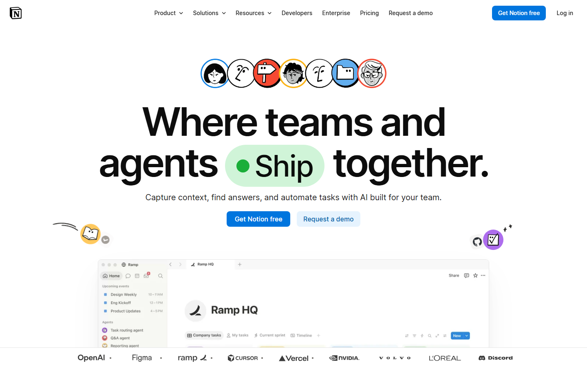
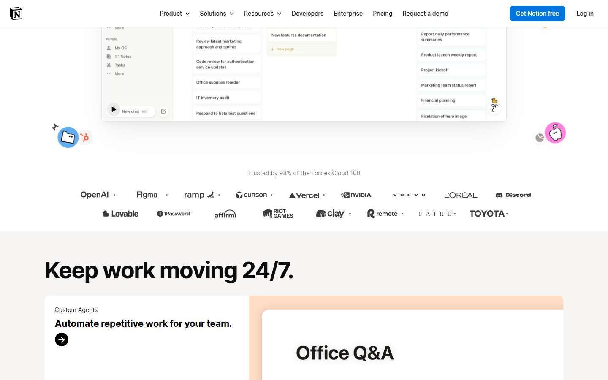
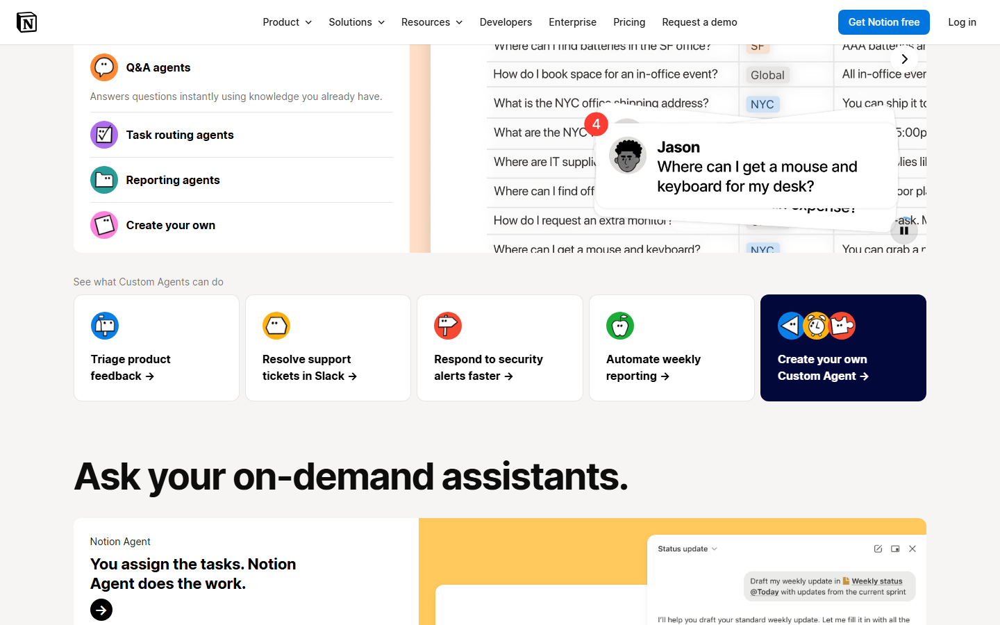
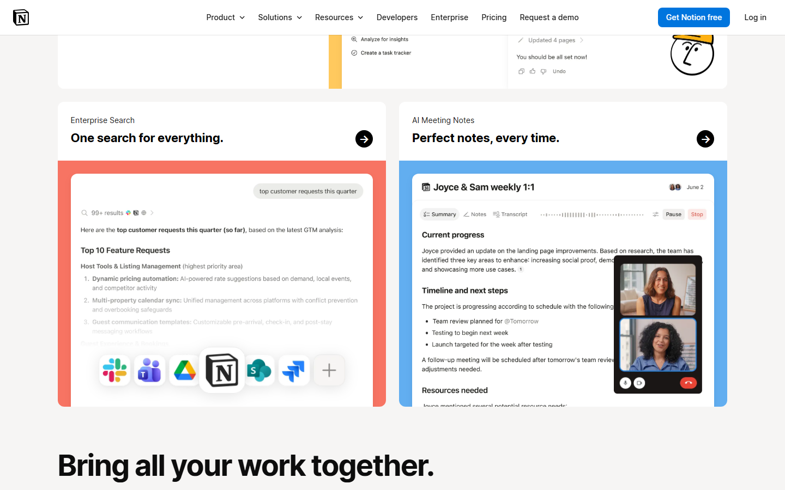
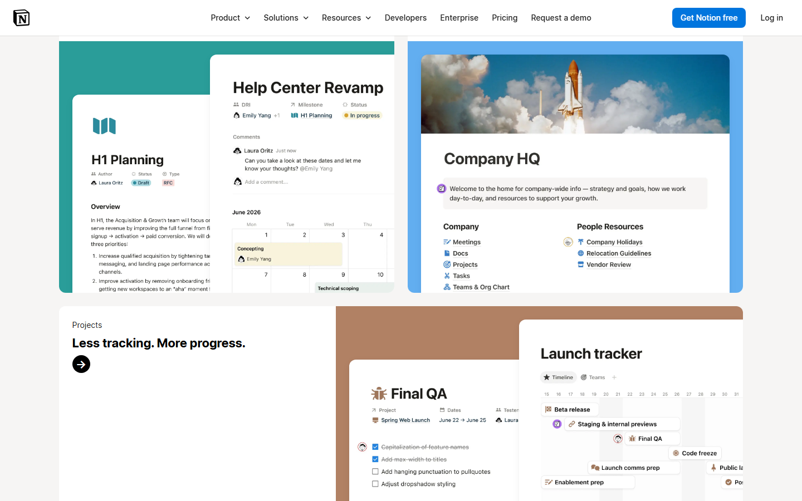
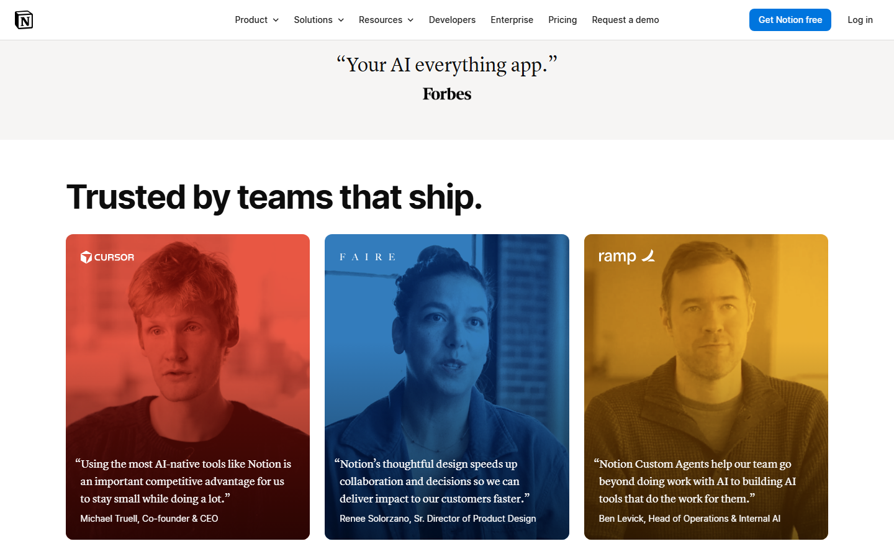
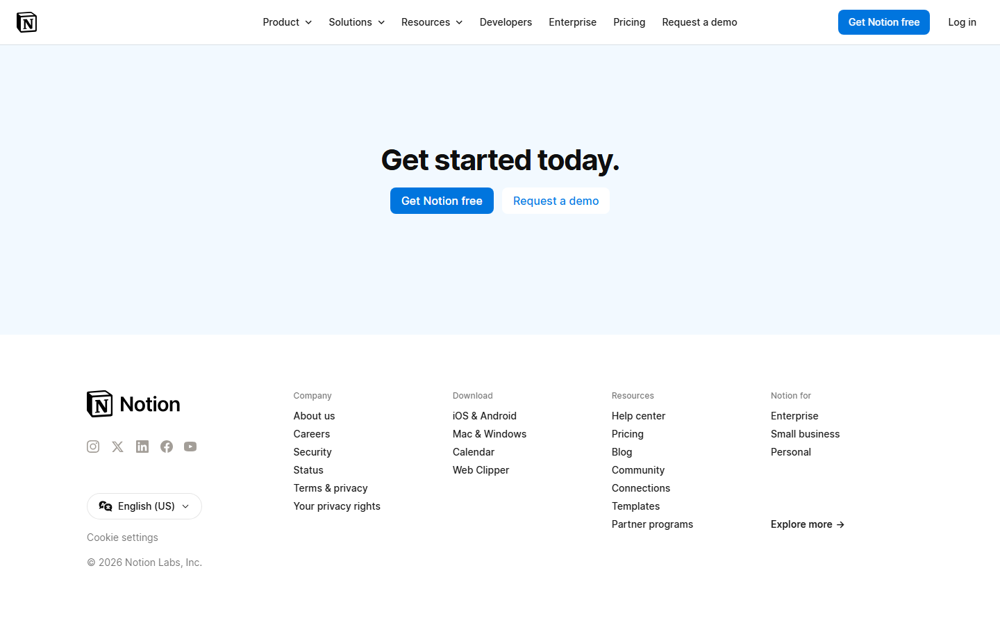
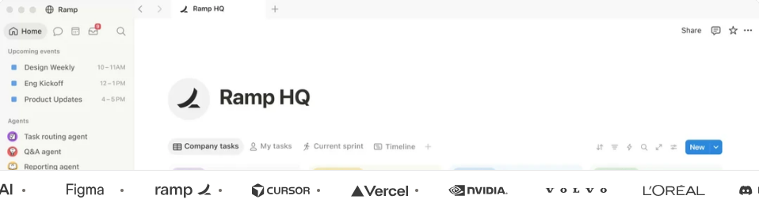
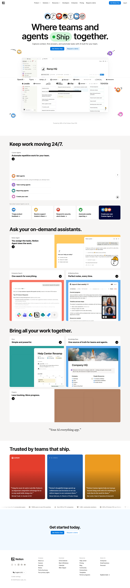
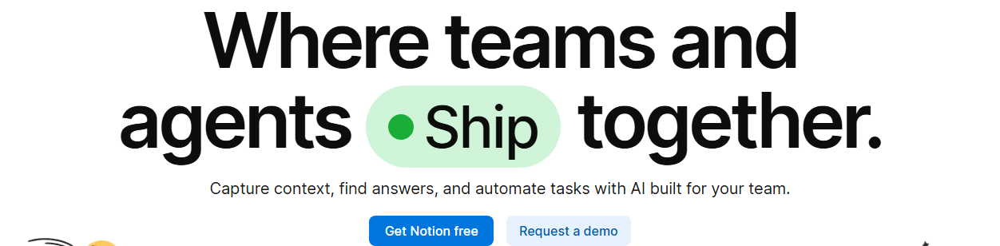

# notion — Visual Guide

> Master visual reference. Study every screenshot carefully before implementing any UI.
> Match colors, layout, typography, spacing, and motion states exactly.

**Motion Stack:** **Web Animations API (36 active)**

## Scroll Journey

The page has cinematic scroll animations. Each screenshot below shows the exact visual state at that scroll depth.
**Replicate these transitions precisely** — the design changes dramatically as you scroll.

### Hero — Above the fold

*Scroll position: 0px of 6484px total*

### 17% scroll depth

*Scroll position: 949px of 6484px total*

### 33% scroll depth

*Scroll position: 1843px of 6484px total*

### 50% scroll depth

*Scroll position: 2792px of 6484px total*

### 67% scroll depth

*Scroll position: 3741px of 6484px total*

### 83% scroll depth

*Scroll position: 4635px of 6484px total*

### Footer — End of page

*Scroll position: 5584px of 6484px total*

## Video Backgrounds

These videos play as background elements. Use first-frame as poster image while video loads.

### Video 1 (background)

*Source: `https://videos.ctfassets.net/spoqsaf9291f/1EL7UZIXfcqngxsNSbL8tR/291f61f56f29dd8...`*

## Full Page Screenshots

### The AI workspace that works for you. | Notion

*URL: `https://notion.com/`*

## Section Screenshots

Clipped sections showing individual components in context.

### Section 9 — `header`

*1252×308px*

